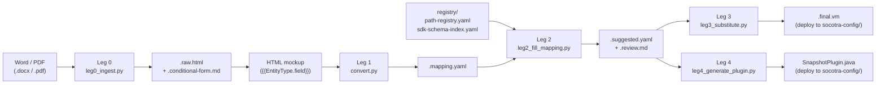

# Document Hot-Swap Architecture

**Status:** Done
**Completed:** 2026-06-09
**Created:** 2026-06-09
**Item:** Plan-for-plans #0

## START HERE (implementing agent)

Three documentation deliverables: update the README hero section (diagram + narrative), reframe CLAUDE.md pipeline framing, and write a new `registry/README.md`. No code changes.

**Read in this order:**
1. This file — §2 (decisions), §3 (task list)
2. `README.md` — current hero (pipeline overview mermaid diagram stops at Leg 3; Leg 0/4 buried in later sections)
3. `CLAUDE.md` — current framing starts with "Converting Word/PDF documents"
4. `registry/` — no README exists

---

## 1. Background

The "hot-swap architecture" is the core value proposition of this tool: a deployed Socotra product config's document templates (`.vm` files under `socotra-config/`) can be updated and redeployed independently of the config JAR. The pipeline acts as the authoring toolchain for that loop:

```
Word/PDF doc → (Leg 0) → HTML → (Leg 1-3) → .final.vm → deploy to socotra-config/
                                                 ↓
                                      (Leg 4) → SnapshotPlugin.java → deploy to socotra-config/
```

Current README says "three-leg pipeline" in the hero and its diagram omits Leg 0 (docx/PDF ingestion) and Leg 4 (plugin generation). CLAUDE.md has no framing intro — it jumps straight to trigger phrases. `registry/` has no README explaining what `path-registry.yaml`, `sdk-schema-index.yaml`, `terminology.yaml`, and `skill-lessons.yaml` each do.

---

## 2. Decisions

| # | Topic | Decision |
|---|-------|----------|
| D1 | README hero diagram | Replace with a Leg 0–4 mermaid diagram. File types shown as labeled nodes (`.docx/.pdf`, `.raw.html`, `.mapping.yaml`, `.suggested.yaml`, `.final.vm`, `.java`). Leg 0 is "ingest" entry; Leg 4 is "plugin" branch off `.suggested.yaml`. |
| D2 | README hero narrative | Lead with the hot-swap value prop: "Update a Socotra document template without redeploying your product config — author in Word/HTML, run the pipeline, deploy the `.vm`." Replace "three-leg" with "Leg 0–4". |
| D3 | CLAUDE.md framing | Add a one-paragraph "Architecture note" at the top of CLAUDE.md (before trigger phrases) explaining the hot-swap loop and which leg does what. Audience: future Claude agents reading it cold. |
| D4 | registry/README.md | New file. One paragraph per registry file: `path-registry.yaml` (all velocity paths for this product), `sdk-schema-index.yaml` (entity→field lookup from JARs, generated), `terminology.yaml` (synonym table for Leg 2), `skill-lessons.yaml` (feedback log for Leg 2 AI matcher). |
| D5 | Scope | Documentation only — no code changes. Do not restructure CLAUDE.md trigger-phrase sections. |

---

## 3. Task list

### T1 — README hero diagram

**Goal:** Replace the Leg 1–3 mermaid diagram with a Leg 0–4 diagram.

**New diagram shape:**



**Files:** `README.md`

---

### T2 — README hero narrative

**Goal:** Rewrite the first 3–4 paragraphs of README.md.

Lead sentence: *"Update a Socotra document template without redeploying your product config — author in Word or HTML, run the pipeline, deploy the `.vm`."*

Replace "three-leg pipeline" with "five-leg pipeline (Leg 0–4)".

Add one-liner per leg:
- **Leg 0** — ingest a Word/PDF doc; extract HTML + a conditional-form for the customer to fill
- **Leg 1** — convert HTML mockup → `.mapping.yaml` with `$TBD_*` placeholders
- **Leg 2** — suggest Socotra Velocity paths for each placeholder; output `.suggested.yaml` + `.review.md`
- **Leg 3** — substitute resolved paths → `.final.vm` (production template)
- **Leg 4** — generate `DocumentDataSnapshotPlugin.java` from `.suggested.yaml`

**Files:** `README.md`

---

### T3 — CLAUDE.md architecture note

**Goal:** Add a short framing block at the very top of CLAUDE.md (before "Converting Word/PDF documents").

```markdown
## Architecture overview

This tool is a **five-leg document pipeline** for authoring Socotra Velocity templates.
The hot-swap loop: author a document (Word/PDF or HTML) → run the pipeline → deploy
the generated `.final.vm` (and optionally the `SnapshotPlugin.java`) to `socotra-config/`
without redeploying the entire product config JAR.

| Leg | Script | Input → Output |
|-----|--------|----------------|
| 0 | `leg0_ingest.py` | `.docx`/`.pdf` → `.raw.html`, `.conditional-form.md` |
| 1 | `convert.py` | `.html` → `.mapping.yaml` |
| 2 | `leg2_fill_mapping.py` | `.mapping.yaml` → `.suggested.yaml`, `.review.md` |
| 3 | `leg3_substitute.py` | `.suggested.yaml` → `.final.vm` |
| 4 | `leg4_generate_plugin.py` | `.suggested.yaml` → `SnapshotPlugin.java` |
```

**Files:** `CLAUDE.md`

---

### T4 — registry/README.md

**Goal:** New file explaining every file in `registry/`.

Sections:
1. `path-registry.yaml` — hand-curated map of all Velocity paths available in this product config. Updated when coverages/fields are added. Used by Leg 2 as the candidate pool.
2. `sdk-schema-index.yaml` — generated artefact; entity-type → field name → return type, built by `scripts/build_schema_index.py` from the compiled JARs. Regenerate whenever JARs change. Used by Leg 2 strict lookup (match_token).
3. `terminology.yaml` — synonym table: plain-English aliases → canonical registry field names. Hand-maintained. Used by Leg 2 Step 3 (cap: `confidence: medium`).
4. `skill-lessons.yaml` — Leg 2 feedback log. Captures confirmed good/bad path suggestions to improve future matches. Written by the pipeline; do not hand-edit.

**Files:** `registry/README.md` (new)

---

## 4. Definition of done

- `README.md` hero section shows Leg 0–4 diagram with file type labels
- "three-leg" no longer appears in README hero
- CLAUDE.md starts with architecture overview table before any trigger phrases
- `registry/README.md` exists and covers all 4 registry files
- `python3 -c "import subprocess; subprocess.run(['python3', 'scripts/agent.py', '--help'])"` still exits 0 (no code changes = no regressions)

---

## 5. Files touched

| File | Change |
|------|--------|
| `README.md` | Replace hero diagram + narrative |
| `CLAUDE.md` | Add architecture overview block at top |
| `registry/README.md` | **New** |

---

## 6. Self-certification (completing agent — required)

When every item in §4 Definition of done is satisfied:

1. Edit this file: change `**Status:** Open` → `**Status:** Done` and add `**Completed:** <date>`.
2. Move this folder: `mv .cursor/plans/pipeline-improvements/00-doc-hotswap-architecture/ .cursor/plans/pipeline-improvements/CompletedPlans/`
3. Commit both changes with your implementation (or in a follow-up commit).

**Do not skip this step.** Plans left "Open" after completion create false signals about remaining work.
