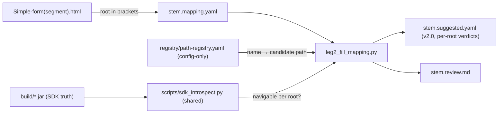

# Leg 2 — Root-aware, SDK-grounded confidence

**Status:** **COMPLETE** — Phases 0–2 shipped (2026-06-03) · Phase 3 spec-only (§14)
**Created:** 2026-06-03
**Plan index:** [README.md](./README.md) · **History:** [history.md](./history.md) (append-only)
**Problem brief:** [problem.md](./problem.md) (read first for the SDK evidence)

---

## START HERE (future agent)

**This plan is complete for in-scope work.** Leg 2 (`scripts/leg2_fill_mapping.py`) is
now **root-aware and SDK-grounded**: confidence is a **verdict per (placeholder ×
rendering root)**, decided by introspecting `build/*.jar` via
`scripts/sdk_introspect.py`, not the config registry alone. Output is
`.suggested.yaml` **schema 2.0**.

| If you are… | Do this |
|-------------|---------|
| **Using** root-aware Leg 2 | Run the verification block in §12 / [README.md](./README.md). Filenames must declare roots: `Simple-form(segment).html`. |
| **Fixing a regression** | Read [history.md](./history.md) (newest first), reproduce with §12, fix, append a handoff. |
| **Extending downstream** (Leg 1/3/4, delta mode) | Read §14 — spec is written; implementation belongs in **separate efforts** (see [Leg 4 plan](../Leg4-document-snapshot-plugin/)). **Do not** expand §14 here without user approval. |

**Read in this order:**

1. [README.md](./README.md) — status table + verification commands.
2. [problem.md](./problem.md) — the `policyNumber` bug and `javap` repro (historical context).
3. [history.md](./history.md) — implementation handoffs.
4. This file — §3 (decisions), §6 (2.0 schema), §9 (task checklist), §14 (downstream spec).
5. Reference code: `scripts/sdk_introspect.py`, `scripts/leg2_fill_mapping.py`,
   `scripts/leg2_review_writer.py`.

**Do not** touch `socotra-config/` as part of this plan.

---

## 1. Problem (one paragraph)

`leg2_fill_mapping.py` grades `high / medium / low` from *name-match strength only*
(`_confidence_from_step`: exact / ci / terminology → `high`). The registry it matches
against (`registry/path-registry.yaml`) is extracted **from `socotra-config/` only** and
models a single notional `$data` root. But at render time `$data` is the
`renderingData` returned by the `DocumentDataSnapshotPlugin`, whose **concrete Java type
differs per document target** (quote → `{Product}Quote`, policy → `{Product}Segment`,
invoice → invoice details). A path can therefore be rated `high` and be **broken at
runtime** — the canonical case being `$data.policyNumber` rated `high` while
`ItemCareSegment` has no `policyNumber()` (the field lives on the sibling
`com.socotra.coremodel.Policy`). See [problem.md](./problem.md) §2 for the `javap`
repro. Leg 4 already detects this but only warns, downstream. This plan pushes that
SDK truth **upstream into Leg 2**.

---

## 2. Solution (this plan's scope)

| Piece | Owner | In scope? |
|-------|-------|-----------|
| JAR introspection per root (quote / segment) | shared `scripts/sdk_introspect.py` (factored from Leg 4) | **Yes** |
| Rendering root(s) declared in the **filename** `<stem>(<root>).html` | parse convention | **Yes** (Leg 2 parses; Leg 1 harmonisation later) |
| Per-`(placeholder × root)` verdicts | `scripts/leg2_fill_mapping.py` | **Yes** |
| `.suggested.yaml` **MAJOR bump → `2.0`** (per-root verdict schema) | this plan + `docs/SCHEMA.md` | **Yes** |
| Registry stays config-only (no JDK at extract time) | `extract_paths.py` unchanged | **Yes (no change)** |
| Sibling detection (`Policy.policyNumber()`) → demote + flag `supply-from-plugin` | `scripts/leg2_fill_mapping.py` | **Yes** |
| Invoice root resolution | — | **No (D5)** — enumerable in filename, not resolved |
| Delta mode (`--mode delta`) ported to per-root verdicts | — | **No (D10)** — deferred to a more mature pipeline; blocked cleanly for now |
| Leg 1 filename parsing; Leg 3 / Leg 4 consuming v2.0 | §14 description only | **No** — described for later harmonisation |
| Plugin actually *lifting* a sibling field onto `renderingData` | future Leg 4 rework | **No** — described in §14 |

---

## 3. Decision history (locked)

Agreed with the user **2026-06-03**. Do not reverse without updating this plan +
[history.md](./history.md).

| # | Topic (maps to problem.md §7) | Decision |
|---|-------------------------------|----------|
| **D1** | §7.1 — where SDK truth lives | **The JARs are the authority.** Leg 2 introspects `build/customer-config.jar` + `build/core-datamodel-*.jar` via `javap` to decide which paths are navigable **per root**. The config registry remains the *name → candidate path* source only; it never decides `high`. (Brief Direction A, reframed: SDK-first.) |
| **D2** | §7.2 — how a doc declares its root(s) | **Filename brackets.** `<stem>(<root>).html` declares the root explicitly, e.g. `Simple-form(segment).html`. `<root>` ∈ `quote` \| `segment` \| `invoice`; multiple allowed comma-separated: `Quote-and-policy(quote,segment).html`. No inference — absence of brackets is an explicit error/blocker (see §8). |
| **D3** | §7.3 — shared doc→root source | **One shared module** `scripts/sdk_introspect.py`. The `{Product}QuoteRequest` / `{Product}Request` / `{Product}Segment` / `{Product}Quote` naming convention (today hardcoded in `leg4_generate_plugin.py`) moves here and is imported by both Leg 2 and (later) Leg 4. |
| **D4** | §7.4 — verdict schema | **MAJOR bump → `.suggested.yaml` `2.0`.** Scalar `confidence` / `data_source` / `reasoning` per variable is **replaced** by a per-root `verdicts` structure (§6). Chosen deliberately over an additive MINOR so a future "analyse-deployed-plugin-and-suggest-updates" process inherits full per-root context. |
| **D5** | §7.5 — invoice scope | **Out of the first cut.** The filename convention can *name* `invoice`, and the schema can *hold* an invoice verdict, but Leg 2 does not resolve invoice paths yet — it emits `sdk_status: skipped` with a deferred note (Leg 4 stubs invoice today). |
| **D6** | Loop-close with Leg 4 (problem.md §4 last bullet) | **Describe, do not build.** First cut: Leg 2 demotes the sibling case to `low` + `next-action: supply-from-plugin` with a sibling hint (`exists on Policy.policyNumber()`). Having the plugin actually lift the field is **future Leg 4 work**, specified in §14. |
| **D7** | Registry generation | **Unchanged.** `extract_paths.py` stays config-only — no JDK / `javap` dependency at registry-build time. SDK truth is applied at Leg 2 rate-time. |
| **D8** | Confidence semantics | `high` now **requires** `sdk_status: verified` on that root **and** a strong name-match (exact / ci / terminology). SDK truth can only **demote**, never promote a weak name-match (§6.3). |
| **D9** | Next-action vocabulary | **No new codes.** Reuse the existing closed vocabulary (`supply-from-plugin`, `confirm-assumption`, …). Sibling case → `supply-from-plugin`. No change to that contract. |
| **D10** | Delta mode (`--mode delta`) | **Out of the first cut** — re-merging into a base `.suggested.yaml` is for a more mature pipeline. `full` / `terse` / `batch` are supported; `delta` is **blocked cleanly** (exit non-zero with a clear message) rather than silently mis-merging a 1.x base into the 2.0 shape. Porting the per-root diff is deferred. |

---

## 4. Repo signposting (what exists today)

| Path | Role for this plan |
|------|--------------------|
| `scripts/leg2_fill_mapping.py` | **Primary edit target.** Name-match Rules 1-6, `suggest_variable`, `_confidence_from_step`, `annotate_mapping`, `merge_delta`, `main`. |
| `scripts/leg4_generate_plugin.py` | **Reuse:** `_javap`, `_zero_arg_methods`, `_unwrap_type`, `validate_path`, `_default_datamodel_jar`, product→class naming. Factor into the shared module. |
| `scripts/leg3_substitute.py` | `_repo_root`, `_load_yaml` patterns (already mirrored by Leg 4). |
| `.cursor/skills/mapping-suggester/scripts/extract_paths.py` | Builds the config-only registry. **Not changed** (D7). |
| `registry/path-registry.yaml` | Name → candidate path source. Single notional `$data`; `meta.note` documents it. |
| `scripts/leg2_review_writer.py` (`_write_review_md`) | Writes `<stem>.review.md`. Must learn the per-root verdict shape (§11). |
| `scripts/suggester_state.py` | Delta / gate / sha helpers used by `main`. The MAJOR bump touches delta logic (§6.5). |
| `.cursor/skills/mapping-suggester/SKILL.md` | Skill contract; "Only use paths from the registry" + name-match precedence. Update for SDK grounding (§9 P2). |
| `docs/SCHEMA.md` | Artifact contract. **MUST** add the `.suggested.yaml` 2.0 row + change-log entry (D4, §11). |
| `build/customer-config.jar` | `{Product}Quote`, `{Product}Segment`, `DocumentDataSnapshotPlugin$*Request`. |
| `build/core-datamodel-v1.7.61.jar` | `Policy`, `Transaction`, `DocumentDataSnapshot`. |
| `samples/output/Simple-form/Simple-form.suggested.yaml` | Pilot input/output; the `POLICY_NUMBER = high` bug to fix. |
| `conformance/fixtures/*` | Golden `.suggested.yaml` / `review.md` — **all break on a MAJOR bump** and must be regenerated (§13). |

**Pilot stem:** `Simple-form`. **Acceptance product:** `ItemCare`.

---

## 5. Rendering-root model (the core idea)

A document renders against exactly the root(s) named in its filename. For `ItemCare`:

| Root id | `renderingData` Java type | Plugin request | Reachable siblings (not the root) |
|---------|---------------------------|----------------|-----------------------------------|
| `quote` | `com.socotra.deployment.customer.ItemCareQuote` | `ItemCareQuoteRequest` | — |
| `segment` | `com.socotra.deployment.customer.ItemCareSegment` | `ItemCareRequest` | `Policy policy()`, `Transaction transaction()` |
| `invoice` | invoice details (deferred — D5) | `InvoiceDetailsRequest` | — |

**Authority order for a `(placeholder, root)` verdict:**

1. **Registry name-match** (existing Rules 1-6) proposes a *candidate* `$data.*` path and
   a `match_step` (`exact` / `ci` / `terminology` / `fuzzy` / `none`). Root-independent.
2. **JAR introspection** (`validate_path` on the root's Java type) decides whether the
   candidate path is **navigable on that root** → `sdk_status`.
3. **Sibling probe** (segment only): if not on the root, walk `Policy` / `Transaction`
   (the other `request.*()` accessors) → `sibling_only` + hint.
4. **Verdict** = `confidence_grade(match_step, sdk_status)` per §6.3.

---

## 6. New artifact contract — `.suggested.yaml` **2.0** (MAJOR)

### 6.1 New top-level key

```yaml
schema_version: '2.0'
# ... existing provenance keys unchanged (run_id, hashes, registry lineage, product) ...
rendering_roots:                 # NEW — derived from filename brackets (D2) + JAR (D3)
  - id: segment
    java_type: com.socotra.deployment.customer.ItemCareSegment
    request: ItemCareRequest
    primary: true                # first root in the filename is primary
  - id: quote
    java_type: com.socotra.deployment.customer.ItemCareQuote
    request: ItemCareQuoteRequest
    primary: false
```

### 6.2 New variable shape (replaces scalar `confidence`/`data_source`/`reasoning`)

```yaml
variables:
- name: POLICY_NUMBER
  placeholder: $TBD_POLICY_NUMBER
  type: variable
  context: { parent_tag: p, line: 11, nearest_label: Policy Number }
  candidate:                        # registry name-match (root-independent)
    path: $data.policyNumber
    match_step: exact
    registry_field: policyNumber
  verdicts:                         # one entry per root in rendering_roots
    segment:
      data_source: ''               # empty: not navigable on this root
      confidence: low
      sdk_status: sibling_only
      sibling_hint: Policy.policyNumber()
      reasoning: 'name-match exact (policyNumber), but ItemCareSegment has no policyNumber();
        field exists on sibling Policy.policyNumber() — next-action: supply-from-plugin'
    quote:
      data_source: ''
      confidence: low
      sdk_status: not_found
      reasoning: 'ItemCareQuote has no policyNumber() (closest: quoteNumber, reservedPolicyNumber)
        — next-action: supply-from-plugin'
```

A genuinely segment-resident field (acceptance counter-example) looks like:

```yaml
- name: LOCATOR
  placeholder: $TBD_LOCATOR
  type: variable
  context: { ... }
  candidate: { path: $data.locator, match_step: exact, registry_field: locator }
  verdicts:
    segment:
      data_source: $data.locator
      confidence: high
      sdk_status: verified
      reasoning: 'exact match: locator → $data.locator; verified locator() on ItemCareSegment'
```

### 6.3 `sdk_status` enum + confidence grading (D8)

| `sdk_status` | Meaning | Confidence given `match_step` |
|--------------|---------|-------------------------------|
| `verified` | path navigable on this root via `javap` | `high` if exact/ci/terminology; `medium` if fuzzy |
| `not_found` | no such method on the root, not on a sibling either | `low` + `supply-from-plugin` |
| `sibling_only` | absent on root, present on `Policy`/`Transaction` | `low` + `supply-from-plugin` (+ `sibling_hint`) |
| `not_navigable` | a path segment returns a scalar/`java.*` and can't be walked further | `low` + `confirm-assumption` |
| `skipped` | invoice root (D5) or no candidate path | `low` (deferred note) |

**Rule (D8): the JAR can only demote.** A `fuzzy` name-match that happens to be
`verified` stays `medium`; SDK truth never upgrades a weak name-match to `high`.

### 6.4 Loop shape

Loops gain the same `verdicts` map (keyed by root). The loop root (`list_velocity`,
e.g. `$data.items`) is validated against each root's type; `available_coverages` stays
as-is (registry-derived). Loop fields are validated against the **iterator element
type** resolved from the root via `javap` (e.g. `ItemCareSegment.items()` →
`ItemCareItem`), not just the registry.

### 6.5 Delta-mode impact (deferred — D10)

`merge_delta` / `suggester_state.compute_delta_change_set` currently diff scalar
`data_source` / `confidence`. Porting them to diff **per-root verdicts** is **out of
the first cut** (D10) — it belongs to a more mature pipeline. For now `--mode delta`
is **blocked cleanly**: `main` exits non-zero with a message like
`ERROR: delta mode not supported for schema 2.0 yet (see Leg2 plan D10); use full/terse`.
A 1.x base file would be shape-incompatible with 2.0 anyway, so failing loud is correct.
`full` / `terse` / `batch` carry all Phase 1 value.

---

## 7. JAR introspection cookbook (reuse Leg 4)

Factor these out of `scripts/leg4_generate_plugin.py` into `scripts/sdk_introspect.py`
**unchanged in behaviour**, then import from both legs:

- `_javap(classpath, fqcn)` → `(rc, text)`
- `_zero_arg_methods(classpath, fqcn)` → `{method: returnType}`
- `_unwrap_type(ret)` → inner FQCN or `None`
- `validate_path(classpath, root_fqcn, "$data.x.y")` → `(status, detail)`
- `_default_datamodel_jar(repo_root)` → newest `core-datamodel-v*.jar`
- **New** `roots_for_product(product, root_ids)` → list of `{id, java_type, request}`
  using the naming convention from Leg 4 §8.4.
- **New** `sibling_probe(classpath, request_fqcn, field)` → `Policy`/`Transaction`
  accessor that exposes `field` (for `sibling_only`).

Classpath: `f"{customer_jar}:{datamodel_jar}"` (same as Leg 4). Verify each root's
Java type exists before grading; if a declared root's type is missing from the JAR,
emit a blocker (§8) rather than a silent `low`.

### Repro the segment gap (sanity check while implementing)

```bash
CP="build/customer-config.jar:build/core-datamodel-v1.7.61.jar"
javap -classpath "$CP" -public com.socotra.deployment.customer.ItemCareSegment | grep -i number   # → nothing
javap -classpath "$CP" -public com.socotra.deployment.customer.ItemCareSegment | grep -i locator   # → locator()
javap -classpath "$CP" -public com.socotra.coremodel.Policy | grep -i policyNumber                 # → Optional<String> policyNumber()
```

---

## 8. Filename → root convention (D2)

- Pattern: `<stem>(<root>[,<root>...]).<ext>`. Example: `Simple-form(segment).html`.
- Allowed roots: `quote`, `segment`, `invoice`. First listed = primary.
- **Leg 2 parses roots from** the mapping's `source:` value (the original HTML filename),
  falling back to the input mapping filename. (Leg 1 harmonisation to strip brackets
  from the stem and write `rendering_roots:` explicitly is §14 — for now Leg 2 is
  self-sufficient by parsing `source:`.)
- **Missing brackets:** hard blocker. Leg 2 writes no verdicts and surfaces a
  `review.md` blocker `rendering root not declared in filename — rename to
  <stem>(segment).html`. No guessing (D2).
- **Unknown root token** (e.g. `(policy)`): blocker listing the allowed set.

---

## 9. Task list

Check boxes when done; log completion in [history.md](./history.md).

### Phase 0 — Planning — **COMPLETE 2026-06-03**

- [x] **P0.1** Capture decisions (this file, §3)
- [x] **P0.2** [history.md](./history.md)
- [x] **P0.3** [README.md](./README.md)

### Phase 1 — Core: root-aware SDK grounding in Leg 2 — **COMPLETE 2026-06-03**

- [x] **P1.1** Create `scripts/sdk_introspect.py`; move `_javap`/`_zero_arg_methods`/
  `_unwrap_type`/`validate_path`/`_default_datamodel_jar` from Leg 4 (Leg 4 imports them
  back — behaviour identical, re-ran Leg 4 §12 `--compile-check` = PASS, no regression).
- [x] **P1.2** Add `roots_for_product()` + `sibling_probe()` to the shared module (§7).
  Also added `resolve_element_type()` (loop fields) + case-insensitive `classify_path()`.
- [x] **P1.3** Filename root parsing + validation (§8); blocker path on missing/unknown.
- [x] **P1.4** Rewrite `suggest_variable` → `derive_variable_candidate` / `suggest_loop_*`
  to emit a `candidate` + per-root `verdicts` map; new `confidence_grade(match_step, sdk_status)` (§6.3).
- [x] **P1.5** `annotate_mapping` writes the 2.0 shape incl. top-level `rendering_roots`;
  bumped emitted `schema_version` to `2.0`; added `--customer-jar` / `--datamodel-jar` CLI
  args (mirror Leg 4 defaults).
- [x] **P1.6** Block `--mode delta` cleanly for schema 2.0 (D10, §6.5) — clear non-zero
  exit + message; `merge_delta` left untouched (now dead code). `full`/`terse`/`batch` work.
- [x] **P1.7** Pilot on `Simple-form(segment).html`; met §12 definition of done.

### Phase 2 — Skill + docs + telemetry

- [x] **P2.1** `docs/SCHEMA.md`: new `.suggested.yaml` **2.0** section + change-log row
  (MAJOR). Documented `rendering_roots`, `candidate`, `verdicts`, `sdk_status` enum.
- [x] **P2.2** `.cursor/skills/mapping-suggester/SKILL.md`: SDK-grounding step, filename
  convention, the "JAR can only demote" rule, new CLI flags.
- [x] **P2.3** `<stem>.review.md` (`leg2_review_writer.py`): per-root verdict rendering;
  Blockers section covers missing-root + sibling-only cases (§11).
- [x] **P2.4** Telemetry (`suggester-log.jsonl`): added `root` + `sdk_status` to placeholder
  records (one record per placeholder × root); JSONL schema extended additively.
- [x] **P2.5** Conformance goldens for the 2.0 shape (§13). Resolved by adding a single
  **JAR-backed** fixture `conformance/fixtures/itemcare-jar/` (real ItemCare config +
  `build/*.jar`) whose 2.0 `suggested`/`review` goldens are produced by a deterministic
  `leg2 --mode terse` run the conformance runner now drives (opt-in via a `leg2.json`
  marker). The synthetic fixtures cannot have JARs (D1), so their orphaned 1.x
  `suggested`/`review` goldens were **retired** — they keep registry-only goldens. Full
  suite green: 13/13 (`itemcare-jar` = registry+suggested+review, rest = registry-only).
  §13 sibling-demotion + segment-resident-high + loop element-type cases all proven there.

### Phase 3 — Downstream harmonisation (DESCRIBE ONLY — do not build) — §14

**Status:** Spec written in §14. **Implementation deferred** to separate plans/efforts.

- [x] **P3.1** Spec Leg 1 filename parsing + `rendering_roots:` emission (§14.1).
- [x] **P3.2** Spec Leg 3 consuming per-root verdicts (§14.2).
- [x] **P3.3** Spec Leg 4 using v2.0 + lifting sibling fields onto `renderingData` (§14.3).
- [ ] **P3.4** (deferred — D10) Port delta mode to per-root verdicts when the pipeline
  matures; until then `--mode delta` stays blocked (P1.6).

---

## 10. Implementation notes

- **Stem derivation:** outputs stay `Simple-form.*` — strip the `(...)` before the
  extension when computing the stem (the bracket is metadata, not part of the name).
- **No new path invention.** `data_source` per root is either the registry candidate
  (when `verified`) or empty (otherwise). Suggesting `quoteNumber()` as an alternative
  on the quote root is *report prose only* (`reasoning`), never a populated
  `data_source` — keeps the "only registry paths" constraint intact.
- **Caching:** `_zero_arg_methods` is called repeatedly per root; memoise per
  `(classpath, fqcn)` within a run to keep `javap` invocations down.
- **JARs required now:** Leg 2 gains a hard dependency on `javap` + the build JARs.
  If JARs are absent, fail loud with the same message style as Leg 4 (`ERROR: customer
  jar not found`).

---

## 11. `review.md` + `SCHEMA.md` changes

- `review.md`: the `## Done` / `## Blockers` / `## Assumptions` sections become
  per-root. Add a root column (or per-root sub-tables). A variable can be `high` on
  one root and a blocker on another — render both.
- `SCHEMA.md`: this is a **MAJOR** bump on `.suggested.yaml`. Per the SCHEMA.md
  compatibility rules, downstream consumers (Leg 3, Leg 4) supporting only `1.x` MUST
  halt with an upgrade message until §14 harmonisation lands. Document that explicitly
  in the change-log row so it is not a silent break.

---

## 12. Definition of done (Phase 1)

```bash
cd /path/to/VelocityConverter1stLeg

# Pilot input renamed per D2 (or a copy):
#   samples/input/Simple-form(segment).html

python3 scripts/leg2_fill_mapping.py \
  --mapping  samples/output/Simple-form/Simple-form.mapping.yaml \
  --registry registry/path-registry.yaml \
  --customer-jar build/customer-config.jar \
  --datamodel-jar build/core-datamodel-v1.7.61.jar \
  --out      samples/output/Simple-form/Simple-form.suggested.yaml \
  --mode terse
```

**Acceptance (mirrors problem.md §8):**

| Check | Expected |
|-------|----------|
| `schema_version` | `'2.0'` |
| `rendering_roots` | contains `segment` (primary), derived from filename |
| `POLICY_NUMBER` on `segment` | **NOT `high`** — `confidence: low`, `sdk_status: sibling_only`, `sibling_hint: Policy.policyNumber()`, `next-action: supply-from-plugin` |
| A segment-resident field (e.g. `LOCATOR` → `$data.locator`) | `confidence: high`, `sdk_status: verified` |
| Missing-bracket filename | blocker in `review.md`, no false `high` |
| Leg 4 regression | `leg4_generate_plugin.py … --compile-check` still exits `0` after the shared-module refactor (P1.1) |
| `socotra-config/` | unchanged |

---

## 13. Conformance / fixtures

A MAJOR bump invalidates every golden `.suggested.yaml` / `review.md` under
`conformance/fixtures/*`. Plan to:

1. Regenerate goldens from live runs (each fixture needs a declared root — add the
   bracket to fixture source names or a `rendering_roots` default for fixtures).
2. Update any conformance runner assertions keyed on the scalar `confidence` shape.
3. Keep at least one fixture that exercises the **sibling demotion** (the
   `policyNumber` case) and one that stays `high` (segment-resident).

---

## 14. Downstream harmonisation (DESCRIBE ONLY — D6, the "bonus")

These are **not implemented here**. They are specified so the future rework is cheap.

### 14.1 Leg 1 (`html-to-velocity`)
- Parse `<stem>(<root>...)` from the input filename; strip brackets from the output
  stem; write a top-level `rendering_roots:` list into `<stem>.mapping.yaml` so Leg 2
  reads it directly instead of re-parsing `source:`.
- Bump `<stem>.mapping.yaml` schema (MINOR — additive `rendering_roots`).

### 14.2 Leg 3 (`substitution-writer`)
- Must choose **which root's `data_source`** drives `.final.vm`. Proposal: the
  `primary` root (first in `rendering_roots`). A token that is `low`/empty on the
  primary root stays a `$TBD_*` (DD-2) and lands in the report with the per-root
  breakdown so reviewers see it's a plugin-supply case, not a name-match miss.
- Reads `2.0`; until then it MAJOR-halts (§11).

### 14.3 Leg 4 (`document-snapshot-plugin`)
- Consume v2.0 `verdicts` instead of re-deriving SDK truth.
- **Close the loop (D6):** for every `sibling_only` verdict, generate the plugin code
  that lifts the sibling field onto `renderingData` (e.g. build a map / wrapper that
  exposes `policyNumber` from `request.policy().policyNumber()`), instead of passing the
  bare segment. This turns today's report-only warning into a real fix.
- The shared `scripts/sdk_introspect.py` (P1.1) is the single source for root/type
  naming so Leg 2 and Leg 4 cannot drift.

### 14.4 "Analyse deployed plugin and suggest updates" (the reason for D4's MAJOR)
- A future process diffs a deployed plugin's actual `renderingData` shape against the
  v2.0 per-root verdicts and proposes minimal plugin edits. The per-root schema gives
  it the full `(field × root)` matrix it needs — which is why we paid the MAJOR cost now.

---

## 15. Architecture diagram



---

## 16. Agent handoff template (append to history.md)

```markdown
## YYYY-MM-DD — Leg 2 root-aware Phase N

### Summary
- ...

### Files touched
- scripts/sdk_introspect.py
- scripts/leg2_fill_mapping.py
- docs/SCHEMA.md
- ...

### Verification
\`\`\`bash
python3 scripts/leg2_fill_mapping.py ... && python3 scripts/leg4_generate_plugin.py ... --compile-check
\`\`\`

### Open items
- ...
```

---

## 17. References

- [problem.md](./problem.md) — SDK evidence, `javap` repro, requirements.
- [`../Leg4-document-snapshot-plugin/00-plan.md`](../Leg4-document-snapshot-plugin/00-plan.md) — house style + `javap` cookbook + golden Java being reused.
- `docs/SCHEMA.md` — artifact contract (MAJOR/MINOR rules; the `.suggested.yaml` row to bump).
- [Socotra — Document Data Snapshot Plugin](https://docs.socotra.com/configuration/plugins/documentDataSnapshot.html)
- [Socotra — Dynamic Documents (`$data` = renderingData)](https://docs.socotra.com/featureGuide/documents/dynamicDocuments.html)
