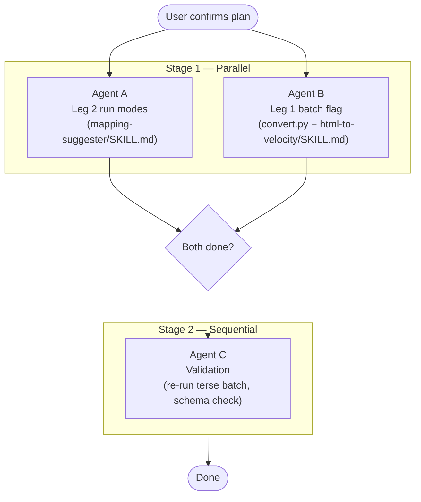

# Pipeline Improvements — Overview

## Goal

Reduce token usage for multi-document pipeline runs by introducing three opt-in run modes (`terse`, `batch`, `delta`) and a multi-file batch flag in Leg 1's Python script.

## Background: why the last run was expensive

| Source | Lines | Notes |
|---|---|---|
| `mapping-suggester/SKILL.md` | 1,347 | Read in full on every invocation |
| `path-registry.yaml` | 1,092 | Re-read once **per document** — 4 reads for 4 docs |
| 4× `.mapping.yaml` inputs | 2,158 | Input context for matching |
| 4× `.suggested.yaml` outputs | 3,608 | Multi-paragraph `reasoning:` per entry |
| 4× `.review.md` outputs | ~1,200 | Prose narrative per blocker |

The two biggest levers: **verbose per-entry reasoning** (output size) and **repeated registry reads** (input size across docs).

---

## Run modes being added

| Mode | Trigger phrase(s) | Token impact |
|---|---|---|
| `full` | (default, no keyword) | Baseline — current behavior unchanged |
| `terse` | "terse", "quick pass", "quick run" | ~50% fewer output tokens |
| `batch` | "batch", "run on all files", multiple file paths | ~60% fewer total tokens for 4-doc runs; forces terse per-doc |
| `delta` | "delta", "re-run", "refresh", "only unconfirmed" | Proportional to remaining unconfirmed entries |

---

## Agent orchestration

**Stage 1** — Agents A and B run in parallel. Neither touches the other's files.

**Stage 2** — Agent C runs only after both A and B signal completion. It re-runs the skills in terse+batch mode against the existing sample files and checks outputs.

---

## Stage files

| File | Agent | Files changed |
|---|---|---|
| [`01-stage-1A-leg2-run-modes.md`](01-stage-1A-leg2-run-modes.md) | A | `.cursor/skills/mapping-suggester/SKILL.md` |
| [`02-stage-1B-leg1-batch.md`](02-stage-1B-leg1-batch.md) | B | `.cursor/skills/html-to-velocity/SKILL.md`, `scripts/convert.py` |
| [`03-stage-2-validation.md`](03-stage-2-validation.md) | C | Read-only (runs scripts, reads outputs) |

---

## Completion criteria

Stage 1 is complete when:
- `mapping-suggester/SKILL.md` contains a `## Run modes` section and all four mode-specific overrides in the execution steps
- `convert.py` accepts `--batch <file1> [file2 ...]` and runs without error against the sample inputs

Stage 2 is complete when:
- A terse-mode run on all 4 sample docs produces `.suggested.yaml` files with single-line `reasoning:` values
- A batch-mode run reads `path-registry.yaml` exactly once and produces 4 output sets
- All output `.suggested.yaml` files pass schema validation (`schema_version: '1.0'` present, no missing required keys)
