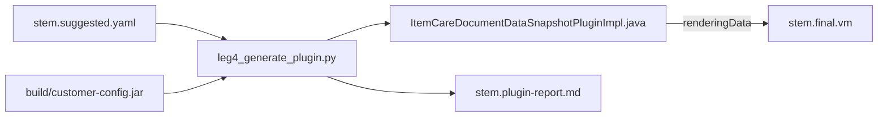

# Leg 4 — Document Data Snapshot Plugin Generator

**Status:** Phase 1 complete — script + pilot pass §12 (2026-06-02)  
**Created:** 2026-06-02  
**Plan index:** [README.md](./README.md) · **History:** [history.md](./history.md) (append-only)

---

## START HERE (implementing agent)

You are building **Leg 4**: a Python script that emits a Socotra **`DocumentDataSnapshotPlugin`** Java class from an existing **`<stem>.suggested.yaml`**, using types from **`build/customer-config.jar`**.

**Read in this order:**

1. This file — §3 (locked decisions), §10 (golden Java), §11 (implementation steps), §12 (definition of done).
2. [history.md](./history.md) — latest handoff / completion notes.
3. Pilot inputs: `samples/output/Simple-form/Simple-form.suggested.yaml` and sibling Leg 3 outputs.
4. Reference script: `scripts/leg3_substitute.py` (YAML loading, repo root, CLI style).

**Do not implement** Phase 3–4 unless the user explicitly asks. **Do not** patch `.suggested.yaml`, edit `socotra-config/`, or add conformance tests in Phase 1.

**When finished:** check off §7 tasks, append a handoff to [history.md](./history.md), run the verification block in §12.

---

## 1. Problem

Legs 1–3 produce a Velocity template (`.final.vm`) whose `$data.*` paths assume Socotra **`renderingData`** from a **`DocumentDataSnapshotPlugin`**. The pipeline stops at `.final.vm` today; plugin code is manual.

- Leg 2 tags unmatched fields with `next-action: supply-from-plugin` in `reasoning`.
- `registry/path-registry.yaml` states: root `$data` = `renderingData` from the snapshot plugin.

Leg 4 closes the gap with **deterministic Java codegen** (no LLM required for MVP).

---

## 2. Solution (MVP)

| Piece | Owner |
|--------|--------|
| Parse `.suggested.yaml`, read `product:` | `scripts/leg4_generate_plugin.py` |
| Introspect JAR via `javap` | same script (inline or `leg4_jar_introspect` module) |
| Emit **one plugin class per product** | same script |
| `renderingData` = full `quote()` / `segment()` | generated Java |
| Report high-confidence path sanity checks | `<stem>.plugin-report.md` |
| Ignore `medium` / `low` variables | by design |
| Cursor skill (invoke script only) | `.cursor/skills/plugin-builder/SKILL.md` |

---

## 3. Decision history (locked)

Agreed **2026-06-02**. Do not reverse without updating this plan + [history.md](./history.md).

| # | Topic | Decision |
|---|--------|----------|
| D1 | Open TODOs / business semantics | OK in later phases; MVP stays thin |
| D2 | Plugin cardinality | **One plugin per product**, many document templates |
| D3 | `renderingData` shape | **Pass full platform object** — Velocity navigates (`$data.policyNumber`, etc.) |
| D4 | YAML auto-fix / plugin-only paths | **Later phase** |
| D5 | Confidence gate | **`high` only** in validation report; **ignore medium/low** |
| D6 | Output location | `samples/output/<stem>/` only; **no** `config.json` edits |
| D7 | Compile truth | `build/customer-config.jar` + `build/core-datamodel-*.jar` |
| D8 | Loops / `#foreach` | Out of scope MVP |
| D9 | Automated tests | Next phase |
| D10 | Missing segment on policy request | **Fail loud:** ERROR log + throw (see §10.2) |

---

## 4. Repo signposting (what exists today)

| Path | Role for Leg 4 |
|------|----------------|
| `samples/output/<stem>/<stem>.suggested.yaml` | **Primary input** — must exist; contains `product:` and `variables:` |
| `samples/output/<stem>/<stem>.vm` | Leg 1 template (Leg 4 does not read it in MVP) |
| `samples/output/<stem>/<stem>.final.vm` | Leg 3 output — runtime companion to plugin |
| `samples/output/<stem>/<stem>.leg3-report.md` | Human context for unresolved `$TBD_*` (optional read) |
| `build/customer-config.jar` | Generated plugin interfaces + `{Product}*` types |
| `build/core-datamodel-v1.7.61.jar` | `DocumentDataSnapshot`, `Policy`, `Transaction`, etc. (pick newest stable jar if flag omitted — see §9) |
| `build/slf4j-api-1.7.36.jar` | Compile classpath for `Logger` / `LoggerFactory` |
| `registry/path-registry.yaml` | Documents `$data` = renderingData convention |
| `scripts/leg3_substitute.py` | **Copy patterns:** `_repo_root`, `_load_yaml`, argparse, report writer |
| `scripts/agent_tools.py` | Phase 3: add `run_leg4()` mirroring `run_leg3()` |
| `scripts/agent.py` | Phase 3: extend `VALID_OPS` |
| `build/tmp/socotra/config/currentlyDeployed/plugins/java/ItemCareRatingPlugin.java` | **Style reference** — package, imports, SLF4J |
| `.cursor/plans/.../Leg4-document-snapshot-plugin/` | This plan |

**Pilot stem:** `Simple-form` under `samples/output/Simple-form/`.

**There is no** `DocumentDataSnapshotPlugin` implementation in deployed plugins today — only the interface stub inside `customer-config.jar`.

---

## 5. Upstream pipeline (prerequisites)

Leg 4 assumes Leg 2 + Leg 3 have already run for the stem (Leg 4 does not require a successful Leg 3, but operators expect `.final.vm` alongside the plugin).

```bash
# If reproducing from HTML (repo root):
python3 scripts/agent.py --yes "RUN_PIPELINE leg1+leg2+leg3 \
  input=samples/input/Simple-form.html \
  registry=registry/path-registry.yaml \
  output=samples/output"
```

Leg 4 **only reads** `.suggested.yaml` (+ JARs). It does not run Leg 1–3.

---

## 6. Input contract — `<stem>.suggested.yaml`

### Required top-level keys (MVP)

| Key | Example (Simple-form) | Use |
|-----|----------------------|-----|
| `product` | `ItemCare` | Derives `{Product}QuoteRequest`, `{Product}Request`, class name |
| `variables` | list of 4 entries | Filter by `confidence`; optional path validation |

### Variable entry shape (per row)

```yaml
- name: POLICY_NUMBER
  placeholder: $TBD_POLICY_NUMBER
  type: variable
  data_source: $data.policyNumber
  confidence: high
  reasoning: 'exact match: policyNumber → $data.policyNumber'
```

**Leg 4 filtering rule:**

```python
high_vars = [
    v for v in suggested.get("variables") or []
    if (v.get("confidence") or "").lower() == "high"
    and (v.get("data_source") or "").strip()
]
```

Ignore `loops:` entirely in MVP.

### YAML loading (match Leg 3)

Strip leading `#` comment lines before `yaml.safe_load` — see `scripts/leg3_substitute.py` → `_load_yaml()`.

### Pilot file snapshot (2026-06-02)

| `name` | `confidence` | `data_source` | Leg 4 |
|--------|--------------|---------------|-------|
| `POLICY_NUMBER` | high | `$data.policyNumber` | Validate path on segment type |
| `POLICYHOLDER_NAME` | medium | `$data.account.data.name` | **Ignored** |
| `INSURANCE_PRODUCT` | low | `""` | **Ignored** |
| `EFFECTIVE_START_DATE` | low | `""` | **Ignored** |

---

## 7. Task list

Check boxes when done; log completion in [history.md](./history.md).

### Phase 0 — Planning

- [x] **P0.1** Capture requirements (this file)
- [x] **P0.2** [history.md](./history.md)
- [x] **P0.3** Plan index [README.md](./README.md)
- [ ] **P0.4** Root `README.md` one-line Leg 4 pointer (optional)

### Phase 1 — Core script (MVP) — **COMPLETE 2026-06-02**

- [x] **P1.1** `scripts/leg4_generate_plugin.py` — CLI, `_load_yaml`, `_repo_root` (mirror leg3)
- [x] **P1.2** JAR introspection via `javap` (§8)
- [x] **P1.3** Emit Java matching §10 golden template
- [x] **P1.4** Policy method: D10 fail loud + SLF4J (§10.2)
- [x] **P1.5** Invoice stub method (§10.3)
- [x] **P1.6** Write `<stem>.plugin-report.md` (§13)
- [x] **P1.7** `--compile-check` (§14)
- [x] **P1.8** Pilot run on Simple-form; §12 definition of done

### Phase 2 — Skill + docs

- [ ] **P2.1** `.cursor/skills/plugin-builder/SKILL.md`
- [ ] **P2.2** `docs/SCHEMA.md` — plugin artifacts section
- [ ] **P2.3** `CLAUDE.md` Leg 4 one-liner

### Phase 3 — Pipeline integration (deferred)

- [ ] **P3.1** `run_leg4()` in `scripts/agent_tools.py`; dispatch in `scripts/agent.py`
- [ ] **P3.2** `.cursor/skills/pipeline-orchestrator/SKILL.md` — `RUN_PIPELINE leg4`

### Phase 4 — Enrichment (deferred)

- [ ] **P4.1**–**P4.6** See §16

---

## 8. JAR introspection cookbook

Run from **repo root**. Requires JDK `javap` on `PATH`.

### 8.1 Confirm plugin interface exists

```bash
javap -classpath build/customer-config.jar -public \
  com.socotra.deployment.customer.DocumentDataSnapshotPlugin
```

**Expect** three `default` methods (names vary by product), e.g. for ItemCare:

- `dataSnapshot(DocumentDataSnapshotPlugin$ItemCareQuoteRequest)`
- `dataSnapshot(DocumentDataSnapshotPlugin$ItemCareRequest)`
- `dataSnapshot(DocumentDataSnapshotPlugin$InvoiceDetailsRequest)`

Nested class names use `$` in `javap` but `.` in Java source.

### 8.2 Product request types (derive from `product:` YAML)

For `product: ItemCare`:

```bash
javap -classpath build/customer-config.jar \
  'com.socotra.deployment.customer.DocumentDataSnapshotPlugin$ItemCareQuoteRequest'

javap -classpath build/customer-config.jar \
  'com.socotra.deployment.customer.DocumentDataSnapshotPlugin$ItemCareRequest'
```

**ItemCareQuoteRequest** (2026-06-02): `quote()` → `ItemCareQuote`.

**ItemCareRequest** (2026-06-02): `policy()`, `transaction()`, `segment()` → `Optional<ItemCareSegment>`, `config()` → `DocumentConfig`.

### 8.3 Rendering types

```bash
javap -classpath build/core-datamodel-v1.7.61.jar:build/customer-config.jar -public \
  com.socotra.coremodel.DocumentDataSnapshot

javap -classpath build/core-datamodel-v1.7.61.jar -public \
  'com.socotra.coremodel.DocumentDataSnapshot$DocumentDataSnapshotBuilder'
```

**Builder methods:** `renderingData(Object)`, `metadata(Object)`, `build()`.

### 8.4 Product naming convention (codegen)

| YAML `product` | Quote request class | Policy request class | Segment type | Output Java class (default) |
|----------------|---------------------|----------------------|--------------|----------------------------|
| `ItemCare` | `DocumentDataSnapshotPlugin.ItemCareQuoteRequest` | `DocumentDataSnapshotPlugin.ItemCareRequest` | `ItemCareSegment` | `ItemCareDocumentDataSnapshotPluginImpl` |

**Algorithm:** `Pascal = product` as-is from YAML; verify nested classes exist via `javap` before emitting. If `javap` fails, exit **1** with message listing missing type.

**Generalisation later:** other products follow same `DocumentDataSnapshotPlugin${Product}*` pattern when customer JAR is regenerated.

---

## 9. Path validation (report-only, non-fatal)

For each **high** variable, strip leading `$data.` from `data_source` and walk the **segment** type (policy documents use segment as `renderingData`).

Example: `$data.policyNumber` → segments `["policyNumber"]`.

**Algorithm (MVP — segment only):**

1. Resolve segment class: `com.socotra.deployment.customer.{Product}Segment` via `javap`.
2. For each path segment, find a public zero-arg method `segmentName()` returning a type; follow with `javap` on return type for nested segments (e.g. `account` → `data` → `name`).
3. If any step missing: add **warning** row in plugin-report (do not fail the run).

Quote-time documents use `quote()` as rendering root — validate against `{Product}Quote` if you add quote-specific high paths later.

**Do not** generate per-field Java in MVP — passing the whole object satisfies all high paths if the object model is correct.

---

## 10. Golden Java output (ItemCare — copy this structure)

**Output path (pilot):**  
`samples/output/Simple-form/ItemCareDocumentDataSnapshotPluginImpl.java`

**Package rule (Socotra):** all customer plugins use `com.socotra.deployment.customer` — **not** a product subpackage (see existing `ItemCareRatingPlugin.java`).

### 10.1 Full reference implementation

```java
package com.socotra.deployment.customer;

import com.socotra.coremodel.DocumentDataSnapshot;
import com.socotra.coremodel.Policy;
import com.socotra.coremodel.Transaction;
import com.socotra.deployment.customer.DocumentDataSnapshotPlugin.InvoiceDetailsRequest;
import com.socotra.deployment.customer.DocumentDataSnapshotPlugin.ItemCareQuoteRequest;
import com.socotra.deployment.customer.DocumentDataSnapshotPlugin.ItemCareRequest;

import java.util.Collections;
import org.slf4j.Logger;
import org.slf4j.LoggerFactory;

/**
 * Generated by scripts/leg4_generate_plugin.py — review before deploying to Socotra.
 * renderingData root ($data in Velocity) = full quote or segment object.
 */
public class ItemCareDocumentDataSnapshotPluginImpl implements DocumentDataSnapshotPlugin {

    private static final Logger log =
            LoggerFactory.getLogger(ItemCareDocumentDataSnapshotPluginImpl.class);

    @Override
    public DocumentDataSnapshot dataSnapshot(ItemCareQuoteRequest request) {
        return DocumentDataSnapshot.builder()
                .renderingData(request.quote())
                .build();
    }

    @Override
    public DocumentDataSnapshot dataSnapshot(ItemCareRequest request) {
        ItemCareSegment segment = request.segment()
                .orElseThrow(() -> {
                    String docName = request.config() != null ? request.config().name() : "unknown";
                    Policy policy = request.policy();
                    Transaction tx = request.transaction();
                    log.error(
                            "Document data snapshot requires a segment but none was present "
                                    + "(document={}, policyLocator={}, transactionCategory={})",
                            docName,
                            policy != null ? policy.locator() : null,
                            tx != null ? tx.transactionCategory() : null);
                    return new IllegalStateException(
                            "Segment required for document data snapshot (document=" + docName + ")");
                });
        return DocumentDataSnapshot.builder()
                .renderingData(segment)
                .build();
    }

    @Override
    public DocumentDataSnapshot dataSnapshot(InvoiceDetailsRequest request) {
        // TODO: invoice-scoped renderingData when invoice documents use this pipeline
        log.warn("Invoice document data snapshot not implemented — returning empty renderingData");
        return DocumentDataSnapshot.builder()
                .renderingData(Collections.emptyMap())
                .build();
    }
}
```

**Imports:** match what `javac` requires; adjust if `Policy`/`Transaction` accessors differ — verify with `javap` on request type.

### 10.2 D10 — fail loud (mandatory)

Policy/segment overload **must not** return `renderingData(null)` or skip the segment check.

Pattern: `orElseThrow` lambda that logs **ERROR** then throws `IllegalStateException` with document name in the message.

### 10.3 Invoice overload (MVP stub)

Return empty `Collections.emptyMap()` + `log.warn` + `// TODO` comment. Non-fatal at compile time.

---

## 11. Implementation steps (Phase 1 checklist)

### Step 1 — Scaffold `scripts/leg4_generate_plugin.py`

Copy from `leg3_substitute.py`:

- `_repo_root()` — walk parents for `.cursor/`
- `_load_yaml(path)` — strip `#` headers
- `argparse` with required `--suggested`, `--output-dir`, `--customer-jar`, optional `--datamodel-jar`, `--compile-check`

Derive `<stem>` from suggested path: `Simple-form.suggested.yaml` → stem `Simple-form` (strip `.suggested` suffix like `agent.py` `_derive_leg3_paths`).

### Step 2 — Resolve product + verify JAR

- Read `product` from YAML; error if missing.
- `subprocess.run(["javap", ...])` — fail fast if interface or nested request types missing.

### Step 3 — Render Java

- Use a triple-quoted template string with `.format(product=..., class_name=...)` or `string.Template`.
- Write `{Product}DocumentDataSnapshotPluginImpl.java` to `--output-dir`.
- Do not overwrite without documenting (MVP: overwrite is fine).

### Step 4 — Path validation + report

- Build report per §13; write `<stem>.plugin-report.md` beside suggested file.

### Step 5 — Optional compile check

- See §14; non-zero exit on failure.

### Step 6 — Manifest (optional)

- `leg4-manifest.json`: `suggested_sha256`, `product`, jar paths, `generated_at`, output files.

---

## 12. Definition of done (Phase 1)

All must pass before checking P1.1–P1.8:

```bash
cd /path/to/VelocityConverter1stLeg   # repo root

python3 scripts/leg4_generate_plugin.py \
  --suggested samples/output/Simple-form/Simple-form.suggested.yaml \
  --output-dir samples/output/Simple-form \
  --customer-jar build/customer-config.jar \
  --datamodel-jar build/core-datamodel-v1.7.61.jar \
  --compile-check
```

**Expect:**

| Check | Expected |
|-------|----------|
| Exit code | `0` |
| Java file exists | `samples/output/Simple-form/ItemCareDocumentDataSnapshotPluginImpl.java` |
| Report exists | `samples/output/Simple-form/Simple-form.plugin-report.md` |
| Report lists | 1 high path validated (or warned), 3 ignored (medium + 2 low) |
| `javac` | succeeds with customer + datamodel + slf4j JARs on classpath |
| Socotra config | **unchanged** |

**Manual deploy (out of scope):** copying the `.java` file to `socotra-config/plugins/java/` and uploading config is a human step until Phase 4.

---

## 13. Plugin report layout (`<stem>.plugin-report.md`)

Mirror tone of `samples/output/Simple-form/Simple-form.leg3-report.md`.

```markdown
<!-- leg4_schema_version: 1.0 -->

# Leg 4 Plugin Report — {stem}

| | |
|---|---|
| **Product** | ItemCare |
| **Suggested mapping** | `Simple-form.suggested.yaml` |
| **Generated Java** | `ItemCareDocumentDataSnapshotPluginImpl.java` |
| **Generated** | {ISO8601 UTC} |

## Rendering strategy

Pass full `{Product}Segment` / `{Product}Quote` as `renderingData` (D3).

## High-confidence paths (validated against segment type)

| Variable | data_source | javap |
|----------|-------------|-------|
| POLICY_NUMBER | $data.policyNumber | ok / warning |

## Ignored (medium / low)

| Variable | confidence | data_source |
|----------|------------|-------------|
| POLICYHOLDER_NAME | medium | ... |

## Compile check

{pass|fail}: {command summary}
```

---

## 14. Compile check command

```bash
javac -encoding UTF-8 \
  -cp "build/customer-config.jar:build/core-datamodel-v1.7.61.jar:build/slf4j-api-1.7.36.jar" \
  -d build/tmp/leg4-compile \
  samples/output/Simple-form/ItemCareDocumentDataSnapshotPluginImpl.java
```

Create `build/tmp/leg4-compile` if needed. Script should use repo-relative paths and print `stderr` on failure.

**Note:** Multiple `core-datamodel-v*.jar` exist under `build/`; default to **v1.7.61** or the version paired with your SDK download. Expose `--datamodel-jar` so CI/agents can override.

---

## 15. Architecture diagram



**Velocity runtime:** Socotra sets template `$data` = plugin `renderingData`. No change to `.final.vm` in Leg 4.

---

## 16. Deferred (do not implement in Phase 1)

| Item | Phase |
|------|-------|
| `RUN_PIPELINE leg4` / MCP | 3 |
| Patch `.suggested.yaml` / registry alias suggestions | 4 |
| `supply-from-plugin` computed fields | 4 |
| Per-document `request.config().name()` branching | 4 |
| Copy to `socotra-config/plugins/java/` | 4 |
| Conformance + unit tests | 4 |
| Medium/low stub methods in Java | 4 |
| `#foreach` / loop snapshot logic | 4 |

---

## 17. Phase 3 integration sketch (for later agents)

**`scripts/agent_tools.py`** — add:

```python
def run_leg4(suggested: str, output_dir: str, customer_jar: str, datamodel_jar: str, compile_check: bool = True) -> dict:
    # subprocess leg4_generate_plugin.py — mirror run_leg3()
```

**`scripts/agent.py`:**

- Add `leg4`, `leg1+leg2+leg3+leg4` to `VALID_OPS`
- `validate_inputs`: require `suggested` path ending in `.suggested.yaml`
- Preflight print: output Java path + report path

**Invocation (future):**

```bash
python3 scripts/agent.py --yes "RUN_PIPELINE leg4 \
  suggested=samples/output/Simple-form/Simple-form.suggested.yaml"
```

---

## 18. Agent handoff template (append to history.md)

When you complete work, append:

```markdown
## YYYY-MM-DD — Leg 4 Phase N complete

### Summary
- Implemented P1.x …
- Generated Java compiles: yes/no

### Files touched
- scripts/leg4_generate_plugin.py
- samples/output/Simple-form/ItemCareDocumentDataSnapshotPluginImpl.java
- …

### Verification
\`\`\`bash
python3 scripts/leg4_generate_plugin.py … --compile-check
\`\`\`

### Open items
- …
```

---

## 19. References

- [Socotra — Document Data Snapshot Plugin](https://docs.socotra.com/configuration/plugins/documentDataSnapshot.html)
- [Socotra — Dynamic Documents (`$data` = renderingData)](https://docs.socotra.com/featureGuide/documents/dynamicDocuments.html)
- Repo: `registry/path-registry.yaml` (lines 8–9, `$data` note)
- Repo: `scripts/leg3_substitute.py` (`supply-from-plugin` in `_ACTION_GUIDANCE`)
- Repo: `docs/SCHEMA.md` (artifact conventions — extend in Phase 2)
- Existing plugin style: `build/tmp/socotra/config/currentlyDeployed/plugins/java/ItemCareRatingPlugin.java`
