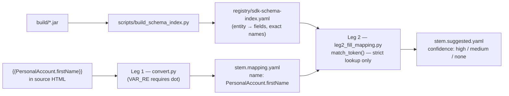

# Strict SDK-Grounded Token Schema

**Status:** Ready to implement
**Created:** 2026-06-05
**History:** [history.md](./history.md)

---

## START HERE (future agent)

This plan eliminates all fuzzy matching in the Leg 1 → Leg 2 pipeline and replaces it with a strict lexicographical lookup driven by the compiled JARs. The core problem: HTML tokens like `{{ACCOUNT_firstNAME}}` carry no type context, so Leg 2 must guess intent through 4 progressively weaker match steps. Any ambiguity in the token name (underscores, casing, prefix decomposition) can silently produce the wrong `$data.*` path with `confidence: high`.

**After this plan:** tokens in source HTML are `{{PersonalAccount.firstName}}` — a dotted path whose two parts (entity type + field) map directly onto the SDK type hierarchy. Leg 2 does a dictionary lookup, not a guess. Unknown tokens become explicit `$TBD_*` placeholders with `confidence: none`.

| If you are… | Do this |
|-------------|---------|
| **Implementing** | Read §3 (decisions), §5 (schema index spec), §7 (match rewrite), §9 (task list) in that order |
| **Fixing a regression** | Read [history.md](./history.md) newest-first, reproduce with §11 verification block |
| **Authoring HTML templates** | Read §4 — the token format reference. Use `registry/sdk-schema-index.yaml` to look up valid `EntityType.fieldName` pairs |

---

## 1. Problem

HTML source templates contain placeholder tokens like `{{ACCOUNT_firstNAME}}`, `{{POLICY_NUMBER}}`, `{{medpay_limit}}`. These are free-form strings with no agreed casing convention or type prefix. Leg 2 (`scripts/leg2_fill_mapping.py`) resolves them to `$data.*` Velocity paths through a 4-step cascade:

1. **Exact** — camelCase match against registry field names
2. **Case-insensitive** — case-fold both sides
3. **Terminology synonyms** — alias table in `registry/terminology.yaml`
4. **Fuzzy** — split on `_`, take the last token, exact-match that against the registry

`scripts/sdk_introspect.py:jar_candidate()` adds two more fuzzy layers when the registry has no candidate:

5. **Prefix fuzzy** — `startswith()` bidirectional, min-length 4 chars
6. **Label-word fuzzy** — split the HTML label by non-word chars, `startswith()` each word

Additional normalisation sites amplify the ambiguity:
- `normalize_mapping_field_name()` silently lowercases any all-caps token (`ACCOUNT_FIRSTNAME` → `account_firstname`) before any match attempt
- `_match_coverage_field()` strips underscores and spaces from coverage names (`re.sub(r"[_ ]", "", raw.lower())`) before prefix decomposition
- Loop field matching repeats the last-token split

The result: `{{ACCOUNT_firstNAME}}` and `{{FIRSTNAME}}` and `{{first_name}}` may all resolve to `$data.firstName` — or to different paths — with no indication that the match was approximate. A token like `{{name}}` can match any field whose name *ends* in `name`.

The downstream effect is false `high` confidence ratings, wrong Velocity paths in `.final.vm`, and broken runtime rendering — the exact class of bug Leg 2's SDK-grounding (Leg2-root-aware-confidence plan) was built to catch after the fact.

---

## 2. Solution (this plan's scope)

| Piece | In scope? |
|-------|-----------|
| Define strict token format `{{EntityType.fieldName}}` in source HTML | **Yes** |
| Build `build_schema_index()` in `sdk_introspect.py` — BFS from rendering roots → flat `{SimpleTypeName: {fieldName: returnFqcn}}` | **Yes** |
| Export schema index to `registry/sdk-schema-index.yaml` for template authors | **Yes** |
| Replace all fuzzy match sites in `leg2_fill_mapping.py` with strict dict lookup | **Yes** |
| Remove fuzzy Steps 3+4 from `jar_candidate()` in `sdk_introspect.py` | **Yes** |
| Remove `normalize_mapping_field_name()` case-folding on all-caps tokens | **Yes** |
| Remove `re.sub(r"[_ ]", "", ...)` normalisation in `_match_coverage_field()` | **Yes** |
| Update Leg 1 token extraction regex to accept dotted-path tokens | **Yes** |
| Backwards-compat: old-format tokens (`{{FIELDNAME}}` no dot) produce `confidence: none`, explicit `$TBD_*` | **Yes** |
| Update existing sample HTML files to the new token format | **Yes — pilot on `Simple-form(quote).html`** |
| Migrate all other HTML samples | **No — separate effort per template** |
| Remove Step 1 (exact) and Step 2 (ci) from `match_name()` | **No** — exact/CI on the *schema index* remains valid; only fuzzy Steps 3+4 and the pre-normalisation are removed |
| Terminology synonyms (`registry/terminology.yaml`) | **Kept** — synonym → canonical mapping is still useful for known alias expansions, but only after strict lookup fails; treated as `confidence: medium` not `high` |
| Delta mode, invoice root, Leg 3/4 downstream harmonisation | **No — separate efforts** |

---

## 3. Decision history

Agreed with user 2026-06-05. Do not reverse without appending to [history.md](./history.md).

| # | Topic | Decision |
|---|-------|----------|
| **D1** | Token format in source HTML | **Dotted path: `{{EntityType.fieldName}}`** where `EntityType` is the Java simple class name (e.g. `PersonalAccount`, `ItemPolicy`, `ZenCoverQuote`) and `fieldName` is the exact zero-arg accessor name as reported by `javap`. Multi-hop paths allowed: `{{ZenCoverSegment.items.limit}}`. No underscores in the entity segment; no casing normalisation. |
| **D2** | Schema index source | **JARs only.** `build_schema_index()` walks `_zero_arg_methods` + `_unwrap_type` recursively from the rendering root FQCNs declared in the filename. The config registry (`path-registry.yaml`) remains the *display-name → candidate* source but is NOT used for type structure. |
| **D3** | Schema index file | **`registry/sdk-schema-index.yaml`** — generated once by a new `scripts/build_schema_index.py` CLI tool, checked in as a reference artefact for template authors. Regenerated whenever JARs change. Leg 2 reads it as a fast lookup dict (no live JAR walk per token). |
| **D4** | Fuzzy fallback | **Removed entirely.** An unrecognised token — one whose `EntityType` is not in the schema index, or whose `fieldName` is not on that entity — produces `confidence: none`, `data_source: ""`, `next-action: fix-token`, and stays as `$TBD_*` in the final template. No silent guesses. |
| **D5** | Old-format tokens | **`confidence: none` with explicit diagnostic.** A token like `{{POLICY_NUMBER}}` (no dot, or a dot in a position that doesn't match a known entity) is flagged in `review.md` as `unresolved — expected format EntityType.fieldName` and stays `$TBD_*`. No backwards-compat fuzzy fallback. |
| **D6** | Coverage name normalisation | **Removed.** `_match_coverage_field()` must match coverage names exactly as declared in the registry — no `re.sub(r"[_ ]", "")` squashing. If a coverage name uses spaces in config, the token must use the same name. |
| **D7** | Terminology synonyms | **Kept at `medium` cap.** Step 3 (synonym lookup) is retained as a known-alias expansion mechanism, but its max confidence is capped at `medium` (not `high`) regardless of SDK verification status. Aligns with the intent: synonyms are human-curated approximations, not SDK facts. |
| **D8** | `normalize_mapping_field_name()` | **Removed from the match path.** The function may remain as dead code for now but is not called during token resolution. Token strings are used verbatim after splitting on the first `.`. |
| **D9** | Schema index depth | **BFS to 3 hops** from the rendering root by default. Deeper navigation is rare in templates and risks combinatorial explosion. Override via CLI flag `--schema-depth N` on the index builder. |
| **D10** | `jar_candidate()` fuzzy steps | **Steps 3 (prefix) and 4 (label-word) removed.** Steps 1 (exact) and 2 (CI) retained — a case-insensitive accessor match against the JAR is still a reliable signal. `jar_candidate()` becomes a strict two-step probe used only when the schema index misses (e.g. a type added after the last index build). |

---

## 4. Token format reference (for template authors)

### Syntax

```
{{EntityType.fieldName}}
{{EntityType.nestedField.leafField}}
```

- `EntityType` = Java simple class name, exact case (e.g. `PersonalAccount`, not `PERSONAL_ACCOUNT`)
- `fieldName` = zero-arg accessor name, exact case (e.g. `firstName`, not `first_name`)
- Separator is `.` — no underscores in the path

### Valid examples (ZenCover)

```
{{PersonalAccount.firstName}}
{{PersonalAccount.lastName}}
{{ZenCoverQuote.locator}}
{{ItemPolicy.limit}}
{{AccidentalDamage.deductible}}
```

### Finding valid tokens

Consult `registry/sdk-schema-index.yaml` — generated from the JARs. Structure:

```yaml
PersonalAccount:
  fqcn: com.socotra.deployment.customer.PersonalAccount
  fields:
    firstName:
      return_type: java.util.Optional<java.lang.String>
      velocity_path: $data.account.firstName      # example — root-dependent
    lastName:
      ...
ZenCoverQuote:
  fqcn: com.socotra.deployment.customer.ZenCoverQuote
  fields:
    locator:
      return_type: java.lang.String
    ...
```

### Old-format tokens (will not resolve)

```
{{POLICY_NUMBER}}        ← no dot → confidence: none → $TBD_POLICY_NUMBER
{{account_firstName}}    ← entity segment lowercase → confidence: none
{{first_name}}           ← no entity prefix → confidence: none
```

---

## 5. Schema index spec (`registry/sdk-schema-index.yaml`)

### Generator: `scripts/build_schema_index.py`

```
python3 scripts/build_schema_index.py \
  --customer-jar build/customer-config.jar \
  --datamodel-jar build/core-datamodel-v1.7.61.jar \
  --product ZenCover \
  --out registry/sdk-schema-index.yaml \
  [--depth 3]
```

### Algorithm (`build_schema_index()` in `sdk_introspect.py`)

```python
def build_schema_index(classpath: str, root_fqcns: list[str], max_depth: int = 3) -> dict:
    """BFS from each rendering root; collect {simple_name: {field: return_fqcn}} for
    all reachable non-primitive types up to max_depth hops."""
    index: dict[str, dict] = {}
    queue: deque[tuple[str, int]] = deque((fqcn, 0) for fqcn in root_fqcns)
    visited: set[str] = set()
    while queue:
        fqcn, depth = queue.popleft()
        if fqcn in visited or depth > max_depth:
            continue
        visited.add(fqcn)
        simple = fqcn.rsplit(".", 1)[-1].rsplit("$", 1)[-1]
        methods = _zero_arg_methods(classpath, fqcn)
        if not methods:
            continue
        index[simple] = {"fqcn": fqcn, "fields": {}}
        for name, ret in methods.items():
            index[simple]["fields"][name] = {"return_type": ret}
            inner = _unwrap_type(ret)
            if inner and inner not in visited:
                queue.append((inner, depth + 1))
    return index
```

### YAML shape

```yaml
# Generated by scripts/build_schema_index.py
# Source: build/customer-config.jar + build/core-datamodel-v1.7.61.jar
# Product: ZenCover  Depth: 3
PersonalAccount:
  fqcn: com.socotra.deployment.customer.PersonalAccount
  fields:
    firstName:
      return_type: "java.util.Optional<java.lang.String>"
    lastName:
      return_type: "java.util.Optional<java.lang.String>"
    ...
ZenCoverQuote:
  fqcn: com.socotra.deployment.customer.ZenCoverQuote
  fields:
    locator:
      return_type: java.lang.String
    account:
      return_type: com.socotra.deployment.customer.PersonalAccount
    items:
      return_type: "java.util.Collection<com.socotra.deployment.customer.ItemQuote>"
    ...
```

---

## 6. Leg 1 changes — token extraction (`convert.py`)

### Current regex

```python
VAR_RE = re.compile(r"\{\{\s*([a-zA-Z_][a-zA-Z0-9_]*)\s*\}\}")
```

Captures a single identifier segment — no dots, no type prefix.

### New regex

```python
VAR_RE = re.compile(r"\{\{\s*([a-zA-Z_][a-zA-Z0-9_]*(?:\.[a-zA-Z_][a-zA-Z0-9_]*)+)\s*\}\}")
```

Requires **at least one dot** — enforces the `EntityType.fieldName` contract at extraction time. Old single-segment tokens will not match this regex and will remain as literal text in the `.vm` output, surfacing as a visible authoring problem rather than a silent bad match.

The `name` captured for a token `{{PersonalAccount.firstName}}` is `PersonalAccount.firstName` verbatim. Leg 2 receives this name and splits on the *first* `.` to get `(entity="PersonalAccount", path="firstName")`.

### Mapping YAML shape (Leg 1 output)

No change to the YAML schema — the `name` field already holds the raw token string. Leg 2 interprets the dotted format.

---

## 7. Leg 2 changes — match rewrite (`leg2_fill_mapping.py`)

### 7.1 New top-level match function

Replace `match_name()` and its 4-step cascade with `match_token()`:

```python
def match_token(
    name: str,          # raw token: "PersonalAccount.firstName"
    schema_index: dict, # from build_schema_index / sdk-schema-index.yaml
    terminology: dict | None,
) -> tuple[list[dict], str, str | None]:
    """Strict schema-index lookup. Returns (entries, step, alias).

    Steps tried (in order):
      exact    — EntityType + fieldName both match exactly in schema index
      ci       — EntityType or fieldName matches case-insensitively
      synonym  — EntityType.fieldName found via terminology.yaml alias (→ max medium)
      none     — no match; caller emits $TBD_* with next-action: fix-token
    """
    if "." not in name:
        return [], "old-format", None   # D5 — flag as old-format, not fuzzy

    entity, *field_parts = name.split(".")
    field_path = ".".join(field_parts)

    # Step 1 — exact: entity name AND field both match verbatim
    if entity in schema_index:
        fields = schema_index[entity]["fields"]
        if field_path in fields:
            return [_make_entry(schema_index, entity, field_path)], "exact", None

    # Step 2 — case-insensitive: look up entity CI, then field CI
    entity_ci = _ci_lookup(schema_index, entity)
    if entity_ci:
        fields = schema_index[entity_ci]["fields"]
        field_ci = _ci_lookup(fields, field_path)
        if field_ci:
            return [_make_entry(schema_index, entity_ci, field_ci)], "ci", None

    # Step 3 — synonym (max confidence: medium regardless of SDK verification)
    if terminology:
        syn_result = _step3_terminology_strict(name, schema_index, terminology)
        if syn_result:
            entries, alias = syn_result
            return entries, "terminology", alias

    return [], "none", None
```

### 7.2 Functions to remove

| Function | Disposition |
|----------|-------------|
| `normalize_mapping_field_name()` | Remove from match path (D8) |
| `snake_to_camel()` | Remove from match path — tokens already carry exact casing |
| `_step4_fuzzy()` | Delete |
| `_match_coverage_field()` — `re.sub(r"[_ ]", "")` normalisation | Remove squashing; coverage name must match exactly |
| Loop field last-token split (`tokens[-1]`) | Remove; loop fields must use `EntityType.fieldName` format too |

### 7.3 `confidence_grade()` update

Add `old-format` and `none` step handling:

```python
def confidence_grade(match_step: str, sdk_status: str) -> str:
    if match_step in ("old-format", "none"):
        return "none"               # explicit unknown — not low, to distinguish from low SDK
    if sdk_status == "verified":
        if match_step in ("exact", "ci"):
            return "high"
        if match_step == "terminology":
            return "medium"         # D7 — synonyms capped at medium
    return "low"
```

### 7.4 `review.md` diagnostic for old-format tokens

Tokens that fail `match_token()` with `step="old-format"` get a dedicated section in `review.md`:

```markdown
## Token Format Errors

The following placeholders use the old `{{FIELDNAME}}` format and were not resolved.
Rename them to `{{EntityType.fieldName}}` using `registry/sdk-schema-index.yaml`.

| Token | Location | Suggested replacement |
|-------|----------|-----------------------|
| {{POLICY_NUMBER}} | p.11 | See sdk-schema-index.yaml — search for `policyNumber` |
```

---

## 8. `sdk_introspect.py` changes

### 8.1 Add `build_schema_index()`

New function per §5. Called by `scripts/build_schema_index.py` CLI and by Leg 2 at startup if `registry/sdk-schema-index.yaml` does not exist (on-demand fallback).

### 8.2 Trim `jar_candidate()`

Remove Steps 3 (prefix fuzzy) and 4 (label-word). Keep Steps 1 and 2 only:

```python
def jar_candidate(classpath, root_fqcn, name_camel, label=None, root_prefix="$data"):
    """Strict two-step probe: exact → case-insensitive only. No prefix/label fuzzy."""
    methods = _zero_arg_methods(classpath, root_fqcn)
    if not methods:
        return None
    nl = name_camel.lower()
    if name_camel in methods:
        return {"method_name": name_camel, "path": f"{root_prefix}.{name_camel}", "match_step": "exact"}
    for m in methods:
        if m.lower() == nl:
            return {"method_name": m, "path": f"{root_prefix}.{m}", "match_step": "ci"}
    return None
```

---

## 9. New CLI tool: `scripts/build_schema_index.py`

Standalone script, runnable outside the pipeline to regenerate the index:

```
python3 scripts/build_schema_index.py \
  --customer-jar build/customer-config.jar \
  --datamodel-jar build/core-datamodel-v1.7.61.jar \
  --product ZenCover \
  --out registry/sdk-schema-index.yaml

# Output:
# Wrote registry/sdk-schema-index.yaml
# 14 entity types  ·  187 fields  ·  depth 3
```

Exits non-zero if JARs missing or no root types found.

---

## 10. Task list

### Phase 0 — Planning — **COMPLETE 2026-06-05**

- [x] **P0.1** Capture decisions and spec (this file)
- [ ] **P0.2** Create [history.md](./history.md)

### Phase 1 — Schema index

- [ ] **P1.1** Add `build_schema_index(classpath, root_fqcns, max_depth)` to `scripts/sdk_introspect.py` (§5, §8.1)
- [ ] **P1.2** Write `scripts/build_schema_index.py` CLI (§9)
- [ ] **P1.3** Run against ZenCover JARs; commit `registry/sdk-schema-index.yaml`
- [ ] **P1.4** Manually verify index contains `PersonalAccount.firstName`, `ZenCoverQuote.locator`, coverage types

### Phase 2 — Match rewrite

- [ ] **P2.1** Add `match_token()` to `leg2_fill_mapping.py` (§7.1)
- [ ] **P2.2** Remove `_step4_fuzzy()`, remove `normalize_mapping_field_name()` from match path, remove `snake_to_camel()` from match path (§7.2)
- [ ] **P2.3** Remove coverage `re.sub(r"[_ ]", "")` squashing from `_match_coverage_field()` (§7.2)
- [ ] **P2.4** Remove loop last-token split from `suggest_loop_field()` (§7.2)
- [ ] **P2.5** Trim `jar_candidate()` to strict two-step (§8.2)
- [ ] **P2.6** Update `confidence_grade()` to handle `old-format` and `none` steps (§7.3)
- [ ] **P2.7** Add `old-format` diagnostic section to `leg2_review_writer.py` (§7.4)

### Phase 3 — Leg 1 token regex

- [ ] **P3.1** Update `VAR_RE` in `convert.py` to require dotted path (§6)
- [ ] **P3.2** Verify old single-segment tokens produce no `.mapping.yaml` variable entry (they are not extracted)
- [ ] **P3.3** Update pilot HTML `samples/input/Simple-form(quote).html` tokens to `{{EntityType.fieldName}}` format using the schema index

### Phase 4 — Integration + verification

- [ ] **P4.1** Run full pipeline on `Simple-form(quote).html` — verify no `$TBD_*` for tokens that were updated to dotted format
- [ ] **P4.2** Verify old-format tokens produce `confidence: none` and appear in review.md diagnostic section
- [ ] **P4.3** Run conformance suite — regenerate any goldens broken by the match rewrite
- [ ] **P4.4** Leg 4 regression: `leg4_generate_plugin.py … --compile-check` still exits 0

---

## 11. Definition of done

```bash
# Step 1 — generate schema index
python3 scripts/build_schema_index.py \
  --customer-jar build/customer-config.jar \
  --datamodel-jar build/core-datamodel-v1.7.61.jar \
  --product ZenCover \
  --out registry/sdk-schema-index.yaml

# Step 2 — full pipeline on updated pilot
python3 scripts/agent.py --yes \
  "RUN_PIPELINE leg1+leg2+leg3 input=samples/input/Simple-form(quote).html \
   registry=registry/path-registry.yaml output=samples/output"
```

| Check | Expected |
|-------|----------|
| `registry/sdk-schema-index.yaml` exists | ≥ 10 entity types, ≥ 50 fields |
| `PersonalAccount.firstName` in index | `return_type: java.util.Optional<java.lang.String>` |
| Updated tokens in `Simple-form.suggested.yaml` | `match_step: exact` or `ci`, `confidence: high` on verified root |
| Old-format token (if any remain) | `confidence: none`, appears in review.md "Token Format Errors" |
| `step4_fuzzy` or `prefix-fuzzy` match step | **Does not appear** anywhere in `Simple-form.suggested.yaml` |
| Conformance suite | All fixtures green (goldens regenerated if shape changed) |
| Leg 4 `--compile-check` | Exit 0, no regression |

---

## 12. Files touched

| File | Change |
|------|--------|
| `scripts/sdk_introspect.py` | Add `build_schema_index()`; trim `jar_candidate()` Steps 3+4 |
| `scripts/build_schema_index.py` | **New** — CLI wrapper for `build_schema_index()` |
| `registry/sdk-schema-index.yaml` | **New generated artefact** — commit after Phase 1 |
| `scripts/leg2_fill_mapping.py` | Replace `match_name()` with `match_token()`; remove 3 fuzzy sites; update `confidence_grade()` |
| `scripts/leg2_review_writer.py` | Add `old-format` diagnostic section |
| `.cursor/skills/html-to-velocity/scripts/convert.py` | Update `VAR_RE` to require dotted path |
| `samples/input/Simple-form(quote).html` | Update tokens to `{{EntityType.fieldName}}` format |
| `conformance/fixtures/` | Regenerate goldens broken by match rewrite |

**Do not touch:** `registry/path-registry.yaml`, `registry/terminology.yaml` (D2/D7), `scripts/leg3_substitute.py`, `socotra-config/`.

---

## 13. Architecture diagram



---

## 14. References

- `scripts/sdk_introspect.py` — existing JAR introspection primitives
- `scripts/leg2_fill_mapping.py` — match cascade to rewrite (lines 92–417, 800–1009)
- `.cursor/plans/pipeline-improvements/CompletedPlans/Leg2-root-aware-confidence/00-plan.md` — SDK-grounding precedent; D1/D8 decisions from that plan remain valid
- `registry/path-registry.yaml` — retained as name → candidate source, not type authority
- `docs/SCHEMA.md` — check if `.suggested.yaml` schema version needs bumping (additive `match_step: old-format` and `confidence: none` values — likely MINOR)
