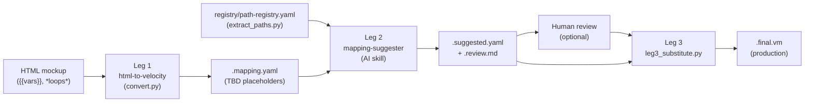

# Socotra Velocity Converter

A three-leg pipeline that turns an HTML mockup into a production-ready Socotra document template.

## Pipeline overview



**Leg 1** (`html-to-velocity`) converts an HTML mockup — annotated with `{{variable_name}}` placeholders and `*loop_name*` markers — into a Velocity `.vm` template and a `.mapping.yaml` file whose `data_source` fields are populated with `$TBD_*` placeholders.

**Leg 2** (`mapping-suggester`) reads the `.mapping.yaml` alongside `registry/path-registry.yaml` (produced by `extract_paths.py` from your Socotra config) and suggests real Socotra Velocity paths for every `$TBD_*` variable and loop. It outputs a `.suggested.yaml` for human review and a `.review.md` summary.

**Leg 3** (`leg3_substitute.py`) reads the `.suggested.yaml` and writes the final `.final.vm` template, substituting `$TBD_*` placeholders with confirmed Socotra paths. A `.leg3-report.md` summarises what was resolved and what remains unresolved. Use `high_only=true` to substitute only `confidence: high` suggestions, leaving medium/low tokens as `$TBD_*` for human review.

## Prerequisites

- Python 3.10+
- `beautifulsoup4` and `pyyaml` (`pip install beautifulsoup4 pyyaml`)
- [Cursor](https://www.cursor.com/) with agent skills enabled

## Quick start

1. **Clone and open in Cursor** — skills auto-register via `.cursor/skills/`.

2. **Run the pipeline** using the orchestrator (`scripts/agent.py`):

   ```bash
   # Full pipeline — HTML → .final.vm (most common)
   python3 scripts/agent.py "RUN_PIPELINE leg1+leg2+leg3 input=samples/input/claim-form.html registry=registry/path-registry.yaml output=samples/output"

   # Full pipeline, high-confidence substitutions only (medium/low stay as $TBD_* for review)
   python3 scripts/agent.py "RUN_PIPELINE leg1+leg2+leg3 input=samples/input/claim-form.html registry=registry/path-registry.yaml output=samples/output high_only=true"

   # Leg 1 only (HTML → .vm + .mapping.yaml)
   python3 scripts/agent.py "RUN_PIPELINE leg1 input=samples/input/claim-form.html output=samples/output"

   # Leg 2 only (suggest paths for an existing .mapping.yaml)
   python3 scripts/agent.py "RUN_PIPELINE leg2 mode=terse mapping=samples/output/claim-form/claim-form.mapping.yaml"

   # Leg 3 only (write final .vm from a reviewed .suggested.yaml)
   python3 scripts/agent.py "RUN_PIPELINE leg3 suggested=samples/output/claim-form/claim-form.suggested.yaml"

   # Leg 3 only, high-confidence substitutions only
   python3 scripts/agent.py "RUN_PIPELINE leg3 suggested=samples/output/claim-form/claim-form.suggested.yaml high_only=true"
   ```

   The orchestrator shows a preflight summary and requires you to type `PROCEED` before running. Add `--yes` to skip confirmation in CI/headless use.

3. **Review the report** — open `<stem>.leg3-report.md` in `samples/output/<stem>/` to see what resolved and what remains as `$TBD_*`. The `.final.vm` is the production template.

> **Note:** You can also invoke Leg 1 and Leg 2 directly (see their `SKILL.md` files under `.cursor/skills/`), but the orchestrator is the recommended entry point.

## Installing into an existing project

1. Copy `.cursor/skills/` into your project root. Cursor picks up skills from `.cursor/skills/` automatically.
2. Generate `registry/path-registry.yaml` from your own Socotra config (default output when `--output` is omitted writes next to the repo root’s `registry/` folder):

   ```bash
   python3 .cursor/skills/mapping-suggester/scripts/extract_paths.py \
     --config-dir <path-to-your-socotra-config/>
   ```

   Or copy the pre-generated `registry/path-registry.yaml` from this repo as a starting point.
3. Optionally add a `terminology.yaml` at the repo root to map customer-specific vocabulary (e.g. "Unit" → "Vehicle") to canonical Socotra names. See `SCHEMA.md` for the format.

## Repository layout

| Path | Description |
|---|---|
| `.cursor/skills/html-to-velocity/` | Leg 1 skill — HTML → Velocity converter |
| `.cursor/skills/mapping-suggester/` | Leg 2 skill — AI path suggester |
| `scripts/leg3_substitute.py` | Leg 3 — substitutes confirmed paths into `.final.vm` |
| `samples/input/` | Sample HTML mockups (4 templates) |
| `samples/output/` | Sample pipeline outputs (`.vm`, `.mapping.yaml`, `.suggested.yaml`, `.review.md`) |
| `socotra-config/` | Bundled sample Socotra config — drives the demo registry |
| `registry/path-registry.yaml` | Pre-generated registry for the bundled config (ready to use) |
| `skill-lessons.yaml` | Seed ledger for Leg 2's lesson-capture system |
| `terminology.yaml` | Sample synonym layer (CommercialAuto vocabulary) |
| `conformance/` | Adversarial conformance fixture suite + runner |
| `.cursor/plans/pipeline-improvements/CompletedPlans/alpha-beta-plan/` | Pipeline runbooks and audits (`PIPELINE_EVOLUTION_PLAN.md`, `PIPELINE_IMPROVEMENTS_PLAN.md`, `GENERALISATION_AUDIT.md`) |
| `SCHEMA.md` | Artifact schema reference (`.mapping.yaml`, `path-registry.yaml`, etc.) |
| `CONFIG_COVERAGE.md` | Socotra config feature coverage matrix |

## Design docs

- [PIPELINE_EVOLUTION_PLAN.md](.cursor/plans/pipeline-improvements/CompletedPlans/alpha-beta-plan/PIPELINE_EVOLUTION_PLAN.md) — session-by-session runbook and hard constraints
- [PIPELINE_IMPROVEMENTS_PLAN.md](.cursor/plans/pipeline-improvements/CompletedPlans/alpha-beta-plan/PIPELINE_IMPROVEMENTS_PLAN.md) — phased improvement roadmap
- [GENERALISATION_AUDIT.md](.cursor/plans/pipeline-improvements/CompletedPlans/alpha-beta-plan/GENERALISATION_AUDIT.md) — CommercialAuto coupling risk report
- [SCHEMA.md](SCHEMA.md) — artifact schema reference
- [CONFIG_COVERAGE.md](CONFIG_COVERAGE.md) — Socotra config feature coverage matrix

## Testing

Run the deterministic conformance fixtures:

```bash
python3 conformance/run-conformance.py
```

The runner fails fast if a legacy root-level `path-registry.yaml` is reintroduced; the canonical registry for this repo lives under `registry/`.

```bash
python3 -m unittest tests.test_socotra_config_fingerprint -v
```

Use `scripts/suggester_inspect.py` to list runs and inspect provenance inside a `<stem>.suggester-log.jsonl` file.

See [conformance/README.md](conformance/README.md) for full workflow details, including how to refresh goldens and add new fixtures.
