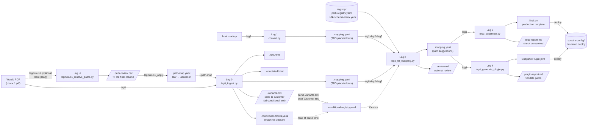

# Socotra Velocity Converter

**Repository:** [github.com/joshlawrence-web/socotra-document-conversion](https://github.com/joshlawrence-web/socotra-document-conversion)

Update a Socotra document template without redeploying your product config — author in Word or HTML, run the pipeline, deploy the `.vm`.

## Pipeline overview



> Full data-flow reference: [docs/pipeline-dataflow.md](docs/pipeline-dataflow.md)

This is a **six-leg pipeline (Leg -1 through Leg 4)**, where Leg -1 is the optional front-door that resolves bare `{leaf}` field names to accessor paths before ingest:

**Leg 0** (`leg0_ingest.py`) ingests a Word/PDF doc; extracts HTML + a single `.variants.csv` for the customer to fill in (the one human-fill file for ALL conditional text), plus a machine `.conditional-blocks.yaml` sidecar read back at parse time.

**Leg 1** (`convert.py`) converts an HTML mockup — annotated with `{{variable_name}}` placeholders and `*loop_name*` markers — into a Velocity `.vm` template and a `.mapping.yaml` file whose `data_source` fields are populated with `$TBD_*` placeholders.

**Leg 2** (`leg2_fill_mapping.py`) reads the `.mapping.yaml` alongside `registry/path-registry.yaml` and suggests real Socotra Velocity paths for every `$TBD_*` variable and loop. It enriches the `.mapping.yaml` in-place (overwriting it with Schema 2.0 suggestions) and writes a `.review.md` summary.

**Leg 3** (`leg3_substitute.py`) reads the enriched `.mapping.yaml` and writes the final `.final.vm` template, substituting `$TBD_*` placeholders with confirmed Socotra paths. A `.leg3-report.md` summarises what was resolved and what remains unresolved.

**Leg 4** (`leg4_generate_plugin.py`) reads the enriched `.mapping.yaml` and emits a compile-correct `{Product}DocumentDataSnapshotPluginImpl.java` plus a `<stem>.plugin-report.md` validation summary. See `.cursor/skills/plugin-builder/SKILL.md`.

## Using with Claude Code (recommended)

The easiest way to use this tool is as an **MCP server** for [Claude Code](https://claude.ai/code). You install it once, and after that you just describe what you want in plain English from any project on your machine — no commands to memorize, no need to keep this repo open.

> **New to MCP?** MCP (Model Context Protocol) is how Claude Code gets custom tools. You register a server once, and Claude automatically knows what it can do. Think of it like installing an app — run a setup command once, then forget it's there and just use it.

### Setup (one time per machine)

**1. Clone and install dependencies**
```bash
git clone https://github.com/joshlawrence-web/socotra-document-conversion.git
cd socotra-document-conversion
pip3 install -e ".[dev]"
```

**2. Register with Claude Code**
```bash
python3 install.py
```

This writes one entry to `~/.claude/settings.json` — a file Claude Code reads at startup to discover available tools. You won't need to touch it again.

**3. Restart Claude Code**

Open a fresh Claude Code session. The tools are now available in every project on your machine.

### How to use it

Open Claude Code in **any directory** — your Socotra config repo, a scratch folder, anywhere. Then describe what you want in plain English:

```
convert templates/claim-form.html
```
```
convert templates/claim-form.html, put output in generated/velocity
```
```
convert templates/claim-form.html, only fill the high confidence fields
```
```
run leg 1 on templates/claim-form.html
```
```
suggest paths for velocity-output/claim-form/claim-form.mapping.yaml
```
```
write the final template for velocity-output/claim-form/claim-form.mapping.yaml
```
```
ingest my Word document at /path/to/policy-form.docx
```
```
list what Velocity paths I can use in my template
```
```
generate the snapshot plugin from workspace/output/ZenCover/ZenCover.mapping.yaml
```

Claude figures out which tool to call. You never need to know the tool names or command syntax.

Paths are relative to whichever directory you have open in Claude Code — not the socotra-document-conversion repo.

### What gets written

Output lands in `velocity-output/<filename>/` by default (you can specify a different location):

| File | What it is |
|------|-----------|
| `<stem>.vm` | Template with `$TBD_*` placeholders (Leg 1 output) |
| `<stem>.mapping.yaml` | Token-to-placeholder mapping, enriched in-place by Leg 2 with path suggestions |
| `<stem>.review.md` | Human-readable confidence breakdown (Leg 2 output) |
| `<stem>.final.vm` | **The production template** — this is what you ship |
| `<stem>.leg3-report.md` | What resolved and what still needs manual attention |

Always check `<stem>.leg3-report.md` first. It tells you which tokens were matched and which still need work.

### High-confidence mode

If you say *"only fill the high confidence fields"*, the server substitutes only tokens it's certain about. Anything medium or low confidence stays as `$TBD_*` in the output and gets listed in the report for you to review. Useful when you want to ship a partial template and handle the fuzzy matches later.

### Troubleshooting

**The tools don't appear in Claude Code**
- Run `python3 install.py` again and confirm it prints a success message
- Open `~/.claude/settings.json` and check that the file path in `args` actually exists on disk
- Fully restart Claude Code (not just a new chat)

**"Leg 1 failed" error**
- The path to your HTML file is wrong — it's relative to the directory you have open in Claude Code, not the socotra-document-conversion repo
- Run `ls templates/claim-form.html` in your terminal to confirm the file is there

**Output goes somewhere unexpected**
- Tell Claude explicitly: *"convert X, put output in path/to/dir"*

---

## Prerequisites

- Python 3.10+
- `pip3 install -e ".[dev]"` (installs the velocity_converter package + beautifulsoup4, pyyaml, mcp, pdfplumber, python-docx, pytest)
- [Claude Code](https://claude.ai/code) for MCP usage — or [Cursor](https://www.cursor.com/) for the script-based workflow below

## Quick start (script-based)

1. **Clone and open in Cursor** — skills auto-register via `.cursor/skills/`.

   ```bash
   git clone https://github.com/joshlawrence-web/socotra-document-conversion.git
   cd socotra-document-conversion
   pip3 install -e ".[dev]"
   ```

2. **Run the pipeline** using the orchestrator (`velocity_converter/agent.py`):

   ```bash
   # Full pipeline — HTML → .final.vm (most common)
   python3 -m velocity_converter.agent "RUN_PIPELINE leg1+leg2+leg3 input=workspace/inbox/Simple-form.html registry=registry/path-registry.yaml output=workspace/output"

   # Leg 1 only (HTML → .vm + .mapping.yaml)
   python3 -m velocity_converter.agent "RUN_PIPELINE leg1 input=workspace/inbox/Simple-form.html output=workspace/output"

   # Leg 2 only (suggest paths for an existing .mapping.yaml)
   python3 -m velocity_converter.agent "RUN_PIPELINE leg2 mapping=workspace/output/Simple-form/Simple-form.mapping.yaml"

   # Leg 3 only (write final .vm from a reviewed .mapping.yaml)
   python3 -m velocity_converter.agent "RUN_PIPELINE leg3 suggested=workspace/output/Simple-form/Simple-form.mapping.yaml"
   ```

   The orchestrator shows a preflight summary and requires you to type `PROCEED` before running. Add `--yes` to skip confirmation in CI/headless use.

3. **Review the report** — open `<stem>.leg3-report.md` in `workspace/output/<stem>/` to see what resolved and what remains as `$TBD_*`. The `.final.vm` is the production template.

> **Note:** You can also invoke Leg 1 and Leg 2 directly (see their `SKILL.md` files under `.cursor/skills/`), but the orchestrator is the recommended entry point.

## Installing into an existing project

1. Copy `.cursor/skills/` into your project root. Cursor picks up skills from `.cursor/skills/` automatically.
2. Generate `registry/path-registry.yaml` from your own Socotra config (default output when `--output` is omitted writes next to the repo root’s `registry/` folder):

   ```bash
   python3 -m velocity_converter.extract_paths \
     --config-dir <path-to-your-socotra-config/>
   ```

   Or copy the pre-generated `registry/path-registry.yaml` from this repo as a starting point.
3. Optionally add a `terminology.yaml` alongside your registry (e.g. `registry/terminology.yaml`) to map customer-specific vocabulary (e.g. "Unit" → "Vehicle") to canonical Socotra names. See `docs/SCHEMA.md` for the format.

## Repository layout

| Path | Description |
|---|---|
| `README.md` | This file — setup, usage, and layout |
| `install.py` / `mcp_server.py` | One-time MCP setup and Claude Code server entrypoint |
| `velocity_converter/` | Installable pipeline package (`agent.py`, `leg2_fill_mapping.py`, `leg3_substitute.py`, …) |
| `tools/` | Dev tooling (`generate_test_fixtures.py`) |
| `.cursor/skills/` | Leg 1 and Leg 2 agent runbooks (docs only — code lives in the package) |
| `workspace/inbox/` | Source docs you feed the pipeline (`.docx`/`.pdf`/`.html`) |
| `workspace/action-needed/` | Human-fill files awaiting a person — variant CSVs (all conditional text), path reviews (gitignored) |
| `workspace/output/` | Per-stem generated pipeline outputs (gitignored — run the pipeline to populate) |
| `registry/` | Pre-generated path registry plus Leg 2 config (`terminology.yaml`, `skill-lessons.yaml`) |
| `socotra-config/` | Bundled sample Socotra config — drives the demo registry |
| `conformance/` | Adversarial conformance fixture suite + runner |
| `tests/` | Unit and integration tests |
| `docs/` | Design references (`SCHEMA.md`, `CONFIG_COVERAGE.md`) |

## Design docs

- [PIPELINE_EVOLUTION_PLAN.md](.cursor/plans/pipeline-improvements/CompletedPlans/alpha-beta-plan/PIPELINE_EVOLUTION_PLAN.md) — session-by-session runbook and hard constraints
- [PIPELINE_IMPROVEMENTS_PLAN.md](.cursor/plans/pipeline-improvements/CompletedPlans/alpha-beta-plan/PIPELINE_IMPROVEMENTS_PLAN.md) — phased improvement roadmap
- [GENERALISATION_AUDIT.md](.cursor/plans/pipeline-improvements/CompletedPlans/alpha-beta-plan/GENERALISATION_AUDIT.md) — CommercialAuto coupling risk report
- [CODEMAP.md](docs/CODEMAP.md) — per-module symbol index (function → line); read this to jump straight to code instead of scanning whole modules
- [leg-internals.md](docs/leg-internals.md) — control-flow diagram + invariants for each leg's internals
- [pipeline-dataflow.md](docs/pipeline-dataflow.md) — end-to-end artifact flow between legs
- [SCHEMA.md](docs/SCHEMA.md) — artifact schema reference
- [CONFIG_COVERAGE.md](docs/CONFIG_COVERAGE.md) — Socotra config feature coverage matrix

## Testing

Run the deterministic conformance fixtures:

```bash
python3 conformance/run-conformance.py
```

The runner fails fast if a legacy root-level `path-registry.yaml` is reintroduced; the canonical registry for this repo lives under `registry/`.

```bash
python3 -m unittest discover -s tests -v
```

Use `velocity_converter/suggester_inspect.py` to list runs and inspect provenance from a `<stem>.suggester-log.jsonl` file (opt-in via `--telemetry-log` on `leg2_fill_mapping.py`).

See [conformance/README.md](conformance/README.md) for full workflow details, including how to refresh goldens and add new fixtures.
