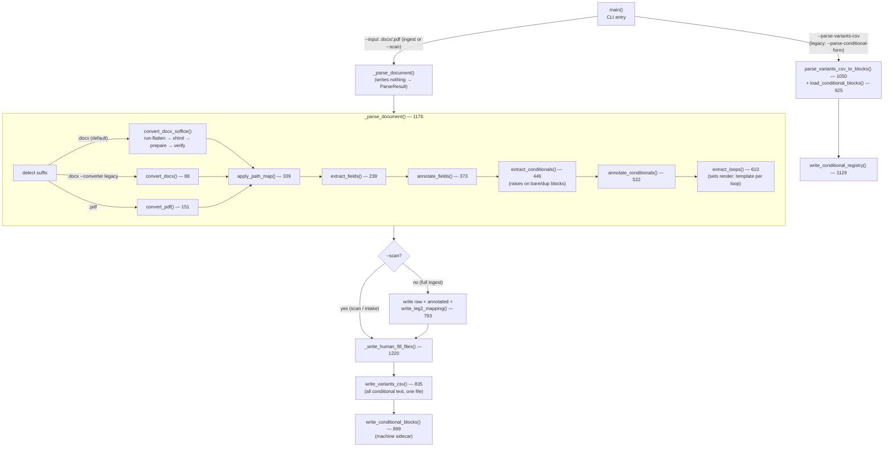
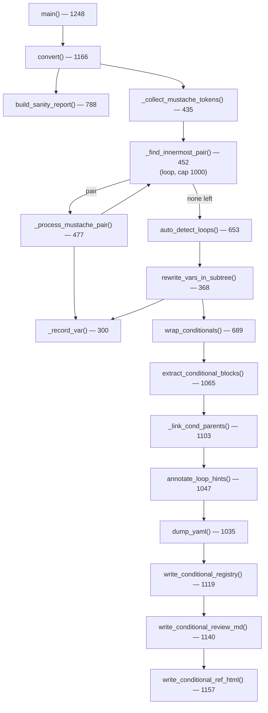
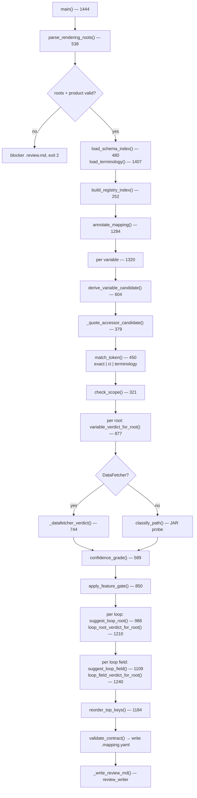
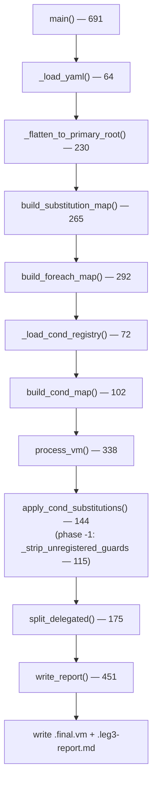
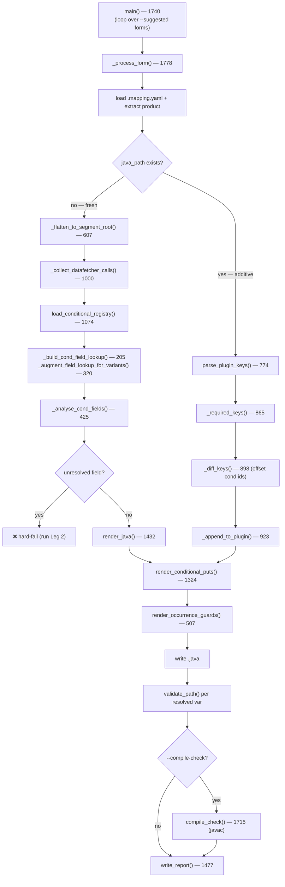

# Leg Internals — control-flow per leg

What happens *inside* each leg: the function call order, branch points, and non-obvious
invariants. Read the relevant section before editing a leg, instead of reading the whole
module. Companion docs:

- [pipeline-dataflow.md](pipeline-dataflow.md) — the end-to-end *artifact* flow between legs
- [CODEMAP.md](CODEMAP.md) — the full per-module symbol index (function → line)

Line numbers drift as code changes; `grep -n 'def <name>'` if one looks off.

---

## Leg 0 — `leg0_ingest.py`

**Entry:** `main()` — three modes: (1) default ingest (`--input <.docx|.pdf>`) extracts
fields/conditionals/loops and emits annotated HTML + mapping + the variants CSV + its sidecar;
(2) `--input … --scan` runs the same parse but writes ONLY the human-fill file (variants.csv)
plus its machine sidecar (conditional-blocks.yaml), front-loading the customer handoff;
(3) `--parse-variants-csv <filled.variants.csv>` parses customer responses (reading the CSV +
its sidecar) → conditional-registry.yaml. The legacy `--parse-conditional-form <form.md>` flag
is retained only for reading in-flight `conditional-form.md` files.

**Shared parse:** both ingest and `--scan` call `_parse_document()` → `ParseResult`
(convert → `extract_fields` → `annotate_fields` → `extract_conditionals` →
`annotate_conditionals` → `extract_loops`); it writes nothing. The caller then chooses
which artifacts to persist — full ingest writes machine artifacts + `_write_human_fill_files()`,
scan writes only `_write_human_fill_files()`. The `render: template` flag the CSV depends on
is set inside `extract_loops`, so scan must run the full parse (not a markup-only regex).

**Inputs → Outputs:** `.docx`/`.pdf` (+ optional `path-map.yaml`) → `.raw.html`,
`.annotated.html`, `.mapping.yaml`, `.variants.csv` (the single human-fill file for ALL
conditional text), `.conditional-blocks.yaml` (machine sidecar); or filled `.variants.csv`
+ `.conditional-blocks.yaml` → `.conditional-registry.yaml`.

**Key internal stages:**
- `convert_docx_soffice()` — the **default** `.docx` converter (lossless styling). Four
  stages: (A) `_normalize_docx_runs()` flattens any Word runs that would split a
  `{field}` / `[[$token]]` / `[Name/]` token across tag boundaries (a run boundary
  becomes a tag boundary in soffice HTML, and the annotators match tokens on the raw
  HTML string); (B) LibreOffice headless converts the normalized temp copy
  (`--convert-to "xhtml:XHTML Writer File"`, unique `-env:UserInstallation` profile per
  invocation — the XHTML filter keeps theme body fonts/sizes that StarWriter HTML
  drops); (C) `_prepare_soffice_html()` cleans XHTML for Velocity (DOCTYPE/xmlns,
  fix `! important`, drop the XHTML `td { font-size:12pt }` override, zero
  horizontal cell padding so tables share the body text edge) while
  keeping source `font-family` names as-is; (D) `_verify_token_integrity()` confirms every token visible in the text
  exists verbatim in the HTML — a failure is a hard `RuntimeError` (a Stage-A gap to
  fix, never HTML to patch). Hard-errors with an install hint when `soffice` is missing.
- `convert_docx()` (88) / `convert_pdf()` (151) — legacy structure-only converters
  (`--converter legacy` for docx; always used for PDF). Styling is discarded.
- `extract_fields()` (239) — regex-extract `{field}` tokens with occurrence symbols (`$ + *`), dedupe, optionally resolve dotted names via registry.
- `extract_conditionals()` (453) — recursive `[[…]]` matching; every block must be a named variant token `[[$placeholder]]` — a bare `[[literal text]]` block raises `ValueError` listing every offender (nothing is written); a table-spanning bare block gets a targeted hint. A repeated `[[$token]]` dedupes to one block with a stderr NOTE (same CSV-keyed text renders at every occurrence).
- `extract_loops()` (558) — match `[Name/]…[/Name]` (trailing slash on the opener marks a loop); move enclosed fields to loop scope; emit `#foreach`/`#end` wrapped in an `#if($doc.<Name>)` guard; append a `render: template` block keyed by the loop name. Legacy `[Name]` openers (no slash) draw a migration warning and stay literal; a loop name colliding with a `[[$token]]` key raises `ValueError`. **Also matches `[Name?]…[/Name]` conditional regions** (the `?` opener — conditional table rows): inside a loop with `Name` a coverage of that exposure → a final `#if($<iterator>.<Name>)` emitted directly (iterator from the registry iterable; per-item coverage presence, no block, no CSV row); inside a loop otherwise → an in-loop **value** region: a `render: template` block with `loop_scope: {loop, iterator}` metadata (when-only CSV row; the `when` is per-item — paths must root at the iterator — parsed via `parse_variants_csv(loop_scoped=…)`, compiled by Leg 3's `condition_to_velocity` into an in-template `#if` inside the loop, skipped by Leg 4); document level with `Name` a registry coverage → a `render: template` block carrying `presence` metadata (skipped in the variants.csv, auto-registered at parse, Leg 4 emits an any-item-carries-it Boolean); document level otherwise → a plain `render: template` block (when-only CSV row, blank = always render). A `[Name/]` loop whose registry iterable is `kind: plugin_list` (e.g. `[Coverage/]` → `$data.coverages`) is resolved by Leg 2 without a JAR verdict — the builder spec is stamped onto the mapping (`plugin_list:`) and Leg 4 generates the list-builder Java.
- `write_variants_csv()` (783) — emit `.variants.csv`, the single human-fill file for ALL conditional text (`[[$token]]` blocks fold to one conditioned row + an empty default row, more rows for N-way; `[Name/]` loop `render: template` blocks fold to a single `when`-only row, blank = unconditional loop).
- `write_conditional_blocks()` (899) — emit the `.conditional-blocks.yaml` machine sidecar (id/key/placeholder/variant/render/source_text/top_level/parent_id/depth) the 3-column CSV can't carry.
- `load_conditional_blocks()` (925) / `parse_variants_csv_to_blocks()` (1050) — read the sidecar + filled CSV → block list with conditions resolved through the DSL.
- `write_leg2_mapping()` (793) — emit `.mapping.yaml` in Leg 2 contract (variables + loops, top-level/loop field split).

**Invariants / gotchas:**
- **Field token format:** `{field}` + occurrence symbol → deduped, normalized to `$TBD_field` (symbol never appears in output); name conflicts keep the first symbol seen and warn on stderr.
- **Loop field membership** is decided *after* field annotation: a field whose every occurrence is inside `[Name/]…[/Name]` moves to that loop; a field used both in and out stays top-level.
- **Every `[Name/]` loop gets its own `render: template` block** keyed by the loop name — `#if($doc.<Name>)` wraps the loop in the template. In the CSV it surfaces as a single `when`-only row: blank `when` = unconditional loop (Leg 3's `_strip_unregistered_guards` removes the guard pair), filled `when` = the guard renames to `#if($data.<Name>)` and the plugin emits `<Name>` as a Boolean. Loop names share a key space with `[[$token]]` names — a collision raises `ValueError`. A `[[$token]]` block fully inside a loop is allowed but warned (conditions are document-scoped, so it renders identically for every item). Genuinely unsupported: an N-way `[[$token]]` block whose variants each carry their own loop (loop bodies can't live in a CSV `text` cell, and `render: template` is binary, not N-way).
- **Conditions use the condition DSL** (`condition_dsl.parse_variants_csv`) — `present`/`absent`, not `!= null`. Conditions are document-scoped: quote/account/policy(segment) accessors only; per-exposure `item.*` is rejected at document scope.
- **Variant placeholder naming:** `[[$stateClause]]` → placeholder `stateClause`; a bare `[[literal text]]` block raises `ValueError` (listing every offender, nothing written); a repeated `[[$token]]` dedupes to one block (every occurrence renders the same CSV-defined text) — no more positional `cond<id>` fallback. `cond<id>` keys are legacy-only now, still parsed from pre-existing registries.
- **Path-map rewrite** runs *before* extraction (non-destructive; the source doc is never modified — the rewrite targets the working HTML).

---

## Leg 1 — `convert.py`

**Entry:** `main()` (1248) → `convert()` (1166).

**Inputs → Outputs:** HTML with `{{variable}}`, `[name]…[/name]` and `[prose]` annotations →
`.vm`, `.mapping.yaml`, `.report.md` (sanity), `.conditional-registry.yaml`, `.conditional-ref.html`.

**Key internal stages:**
- `_collect_mustache_tokens()` (435) — scan DOM for `[name]`/`[/name]` loop markers.
- `_find_innermost_pair()` (452) / `_process_mustache_pair()` (477) — convert loops innermost-first → `#foreach $iter in $TBD_name`, recording loop fields separately.
- `rewrite_vars_in_subtree()` (368) — `{{var}}` → `$TBD_var` outside loops, with nearest-label context.
- `wrap_conditionals()` (689) — wrap block-level elements bearing `$TBD_*` in `#if(…)…#end`.
- `extract_conditional_blocks()` (1065) — `[prose]` → `$doc.condN`, link parent/child nesting.

**Label inference:** `_record_var()` (300) → `nearest_label()` (131) walks up ≤5 parents for
the first non-empty previous-sibling text; for `<td>`, `nearest_column_header()` (148) reads the
header at the matching column index.

**Invariants / gotchas:**
- Loop pairing is innermost-first with a 1000-iteration safety cap; unconsumed tokens and cross-parent pairs become warnings, not errors.
- Loop-scoped `$TBD_` tokens are prefixed `$iterator.TBD_…` (e.g. `$vehicle.TBD_year`).
- `wrap_conditionals()` skips text already inside a `#foreach` (`_inside_foreach()` 725) to avoid double-guarding.

---

## Leg 2 — `leg2_fill_mapping.py`

**Entry:** `main()` (1444) → `annotate_mapping()` (1284).

**Inputs → Outputs:** `<stem>(root).mapping.yaml` + `path-registry.yaml` (optional
`terminology.yaml`, `sdk-schema-index.yaml`) → enriched `<stem>.mapping.yaml` (schema 2.0) + `.review.md`.

**Matching pipeline (per variable):**
1. `derive_variable_candidate()` (604) — root-independent name match via `match_token()` (450): exact `Entity.field` → case-insensitive → terminology synonym; `_quote_accessor_candidate()` (379) handles direct `quote.data.*`. `check_scope()` (321) gates by required `#foreach` iterator. Terminal candidates (no match / scope violation / ambiguous) skip JAR probing.
2. `variable_verdict_for_root()` (877), per root — DataFetcher lifecycle gate (`_datafetcher_verdict()` 744) **or** `classify_path()` JAR probe on the reprefixed path.
3. `apply_feature_gate()` (850) — demotes verdicts (clears `data_source`, `sdk_status: feature_gated`) when a `requires_feature` flag is disabled.

Loops: `suggest_loop_root()` (988) does exact iterable-name lookup → list velocity + iterator;
`suggest_loop_field()` (1109) parses `$ITER.TBD_FIELD` and matches an exposure field or a coverage
via `_match_coverage_field()` (1048, prefix decomposition e.g. `medpay_limit` → `MedPay.limit`).

**Verdict + confidence:**
- `confidence_grade()` (589): `high` only when `match_step == exact` AND `sdk_status == verified`; else `low`/`none`.
- DataFetcher verdicts bypass the direct-path probe; lifecycle gate may demote to low.
- Feature-gated paths → `confidence: low`, `sdk_status: feature_gated`, empty `data_source`, **across all roots** (document-scoped).
- Sibling-only matches → `confidence: medium` with the sibling path as `data_source`.

**Invariants / gotchas:**
- Strict schema-index validation: tokens must be `Entity.field` dotted; old `{FIELDNAME}` or unknown entity/field → terminal, `next-action: fix-token`.
- Quote-accessor candidates carry `no_reprefix: True` — `quote.data.field` is terminal and not reprefixed to a root prefix.
- Scope violation is terminal (`next-action: restructure-template`) — never escalated by a JAR probe.
- Loop-field verdicts cache the iterator element type per (root, list_velocity) to avoid redundant JAR walks.

---

## Leg 3 — `leg3_substitute.py`

**Entry:** `main()` (691).

**Inputs → Outputs:** enriched `.mapping.yaml` (+ optional `.conditional-registry.yaml`) + the
Leg 1 `.vm` → `.final.vm` + `.leg3-report.md`.

**Key internal stages:**
- `build_substitution_map()` (265) — `{$TBD_*: data_source path}` from variables + loop fields.
- `build_foreach_map()` (292) — loop placeholder → `#foreach` directive (where both data_source and foreach exist).
- `build_cond_map()` (102) — `$doc.<key>` → `${data.<key>}`.
- `process_vm()` (338) — strip `#if($TBD_*)` guards, substitute resolved tokens, replace foreach placeholders.
- `_strip_unregistered_guards()` (115) — phase -1 of `apply_cond_substitutions`: strip `#if($doc.X)…#end` pairs whose key has no conditional-registry entry — a `[Name/]` loop whose `when` row was left blank (unconditional loop), keeping the content.
- `apply_cond_substitutions()` (144) — phase -1 guard strip, then phase 0 renames surviving `#if($doc.X)` template guards to `#if($data.X)`, then multi-pass innermost-first resolution of `[[…]]$doc.<key>` blocks.
- `split_delegated()` (175) — separate tokens that live only inside conditional blocks (plugin-wired) from template-resolved tokens.

**Invariants / gotchas:**
- Unresolved tokens (`$TBD_*` with empty data_source) stay verbatim in the output and are listed in the report.
- A `[Name/]` loop's `#if($doc.<Name>)` guard is stripped (content kept) when the customer left the loop's `when` row blank; otherwise it renames to `#if($data.<Name>)` and the plugin supplies `<Name>` as a Boolean.
- `$doc.<key>` → `${data.<key>}` because the **plugin owns conditional text**; the template only emits the resolved block string.
- Tokens inside `[[…]]$doc.condN` blocks are *delegated to Leg 4* — they don't appear in `.final.vm`, only in the report.
- `#if($TBD_*)` guard wrappers are stripped entirely; nested `#if`/`#foreach` inside them are preserved with substitution.
- Schema 2.0 mapping promotes per-root verdicts to flat fields via the primary root; schema 1.x passes through unchanged.

---

## Leg 4 — `leg4_generate_plugin.py`

**Entry:** `main()` (1740) → `_process_form()` (1778), called once per `--suggested` form.

**Inputs → Outputs:** one `.mapping.yaml` (+ `.conditional-registry.yaml`) per form → one
`{Product}DocumentDataSnapshotPluginImpl.java` (fresh or appended) + one `.plugin-report.md` per form.

**Generation stages:**
1. `_flatten_to_segment_root()` (607) — schema 2.0 per-root verdicts → segment root.
2. `_collect_datafetcher_calls()` (1000) — DataFetcher vars per scope (quote & policy).
3. `load_conditional_registry()` (1074) → `_build_cond_field_lookup()` (205) + `_augment_field_lookup_for_variants()` (320) → `_analyse_cond_fields()` (425).
4. `render_java()` (1432) or `_append_to_plugin()` (923) — assemble the `.java`.
5. `render_conditional_puts()` (1324) — binary + variant `if/else-if/else` chains (binary now routes through the variant generator); template blocks via `_render_template_put()` (1269).
6. `render_occurrence_guards()` (507) — null/empty checks for required & one_or_more.
7. `validate_path()` (javap-walk) → `compile_check()` (1715, optional) → `write_report()` (1477).

**Fresh vs additive vs multi-form:**
- **Fresh** (no existing `.java`): `render_java()` writes a complete file.
- **Additive** (`.java` exists): `parse_plugin_keys()` (774) reads existing keys + conditional high-water mark; `_diff_keys()` (898) computes missing keys and offsets conditional IDs past the high-water mark; `_append_to_plugin()` (923) inserts only the missing puts (a `.java.bak` is written first).
- **Multi-form:** each form runs `_process_form()` sequentially — first writes/appends, each subsequent merges additively into the same `.java`.
- **Named variant blocks** merge by `block_key()` (name-based) — no positional renumber; a duplicate name is a logged conflict.

**Conditional / variant / occurrence handling:**
- **Single-conditioned-row `[[$token]]` block** (the ordinary show/hide case, and the legacy `cond<id>`-keyed binary block from an old registry) routes through the variant generator (`_render_variant_puts()` 1209) as a one-real-row + empty-default fold: `String <key> = ""; if (<java_cond>) { <key> = <baked_text>; }`.
- **N-way variant** (`_render_variant_puts()` 1209): `if (<cond0>) {…} else if (…) {…} else { <default> }`, first match wins.
- **Template block** (`_render_template_put()` 1269): emits a Boolean `condN` from the single `when` AST (new flow) or legacy `conditions[]`.
- **Field tokens inside blocks** → in-scope fields wired as Java accessor concat (`Objects.toString(policy.data().lastName(), "")`); unresolved field inside a block **hard-fails** (run Leg 2); unsupported (per-exposure/account/DataFetcher) → `// TODO` + WARN row.
- **Occurrence guards:** required/one_or_more vars add to `missingRequired`; throw `IllegalStateException` before returning `renderingData`.
- **Scope blocking:** a quote-scoped condition in the policy overload (or vice-versa) renders an empty put; mixed-scope blocks render empty in both overloads.

**Invariants / gotchas:**
- Conditional-ID renumber is form-local and positional — legacy-only, for `cond<id>`-keyed blocks from old registries; named `[[$token]]` variants and `[Name/]` loop template blocks never renumber (merged by name).
- Occurrence guard names are tracked in the existing `.java` so additive re-runs don't double-guard.
- DataFetcher calls are deduped per root and skipped when the root isn't in `valid_roots`; the legacy `pricing` key is always skipped for quote.
- `segment` is optional in the policy overload (`.orElse(null)`) — a missing segment warns but does not fail.
