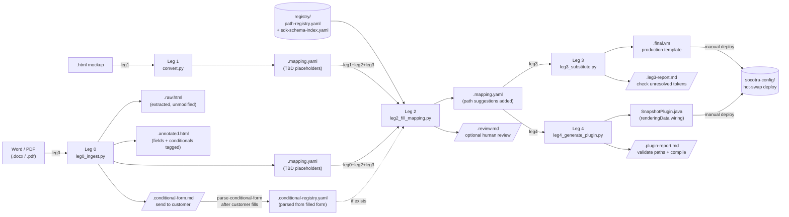

# Pipeline Data-Flow — Leg 0–4

End-to-end view of every file artifact and human touchpoint in the Velocity Converter pipeline.

**Shape key:**
- Rectangle `[text]` — pipeline script or pipeline-managed artifact
- Parallelogram `[/text/]` — human touchpoint (requires action or review)
- Cylinder `[(text)]` — persistent store (registry or deploy target)
- Dashed arrow `-.->` — optional / conditional input

---

## Walk-through

### Starting from a Word or PDF document (Leg 0 path)

Leg 0 (`leg0_ingest.py`) converts a `.docx` or `.pdf` into four artifacts: `.raw.html` (the
unmodified extracted HTML), `.annotated.html` (HTML with `{field}` placeholders replaced by
`$TBD_field` tokens and conditional blocks tagged as `$doc.condN`), `.mapping.yaml` (the
Leg 2 input, pre-populated with TBD placeholders), and `.conditional-form.md` (a
Markdown questionnaire listing every detected conditional block, to be filled in by the
customer or document owner). The form displays field placeholders in the author's
`{field}` syntax; parsing converts them back to canonical `$TBD_field` tokens in the
registry (both forms parse).

A conditional block may contain `{field}` placeholders. Because the Leg 4 plugin owns
conditional text (the template only outputs `${data.condN}`), those fields are resolved
**in Java**: Leg 4 concatenates the field's accessor into the conditional string
(quote system fields in the quote overload; policy system/custom fields in the policy
overload, custom fields via the segment type). Leg 3 reports such tokens as
"Delegated to plugin" rather than template-resolved. Leg 4 hard-fails if a field inside
a block has no `data_source` (run Leg 2 first); per-exposure, account, and
DataFetcher-sourced fields are TODO-flagged in the plugin report instead of wired.

When the conditional form is returned, run `leg0_ingest.py --parse-conditional-form` to
produce `.conditional-registry.yaml`. Leg 2 reads this registry automatically if it exists
alongside the mapping file. If the conditional form is skipped, Leg 2 still runs — the
`$doc.condN` placeholders in the template will remain unresolved until the registry is
provided.

### Starting from an HTML mockup (Leg 1 path)

Leg 1 (`convert.py`) reads an HTML file annotated with `{{variable_name}}` placeholders
and `*loop_name*` markers and produces `.mapping.yaml` with TBD placeholders and an
auto-detected `.conditional-registry.yaml` derived from the HTML structure. This path
is used when the document owner is comfortable editing HTML directly instead of Word.

### Path-matching and review (Leg 2)

Leg 2 (`leg2_fill_mapping.py`) reads the `.mapping.yaml` together with
`registry/path-registry.yaml` and (if present) `sdk-schema-index.yaml`. It queries the
registry for every `$TBD_*` token, scores candidates by semantic similarity and
confidence, then writes the suggestions back into the `.mapping.yaml` in-place. It also
emits `.review.md` — a human-readable confidence breakdown grouped by high / medium /
low. Review this file before running Leg 3 if any medium or low confidence matches exist.

### Template finalisation (Leg 3)

Leg 3 (`leg3_substitute.py`) reads the enriched `.mapping.yaml` and produces the final
`.final.vm` Velocity template by substituting all resolved `$TBD_*` tokens with their
confirmed Socotra paths. Any tokens that could not be resolved remain as `$TBD_*` in the
output and are listed in `.leg3-report.md`. Run with `high_only=true` to defer medium and
low confidence matches to a separate "Deferred" section and leave them as `$TBD_*` for
manual review.

### Plugin generation (Leg 4)

Leg 4 (`leg4_generate_plugin.py`) branches off the same `.mapping.yaml` used by Leg 3 —
not off `.final.vm`. It reads every resolved path in the mapping and generates a
compile-correct `{Product}DocumentDataSnapshotPluginImpl.java` that populates
`renderingData` at document snapshot time. If a Java file already exists in the output
directory, Leg 4 runs in additive mode: it only adds missing keys and never removes
existing ones. The `.plugin-report.md` shows which paths were validated against the
customer JARs and whether the compile check passed.

### Deploying to Socotra

Both `.final.vm` and `SnapshotPlugin.java` are deployed manually to `socotra-config/`.
The `.vm` file goes under the `documents/` tree; the Java file goes under
`plugins/java/`. Deploy only these two files — no product config JAR rebuild is needed.
This is the hot-swap loop: author → pipeline → deploy `.vm` + `.java` → done.
