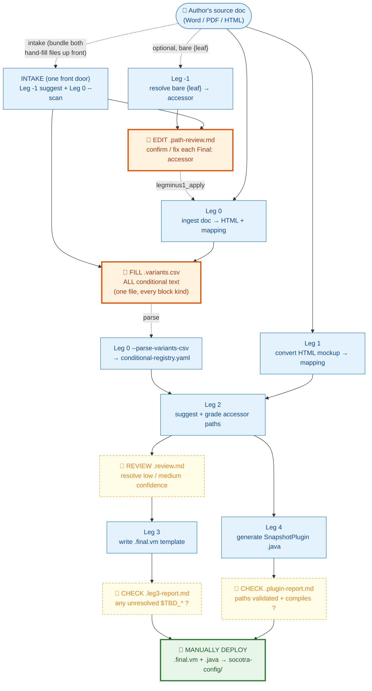

# Pipeline Data-Flow — Leg 0–4

End-to-end view of every file artifact and human touchpoint in the Velocity Converter pipeline.

> This doc covers the flow *between* legs. For what happens *inside* a leg, see
> [leg-internals.md](leg-internals.md); to jump to a specific function, see [CODEMAP.md](CODEMAP.md).

```mermaid
flowchart LR
  %% ── Inputs ──────────────────────────────────────────
  DOC["Word / PDF\n(.docx / .pdf)"]
  HTML[".html mockup"]

  %% ── Pipeline legs ───────────────────────────────────
  LegM1["Leg -1\nlegminus1_resolve_paths.py"]
  Leg0["Leg 0\nleg0_ingest.py"]
  Leg1["Leg 1\nconvert.py"]
  Leg2["Leg 2\nleg2_fill_mapping.py"]
  Leg3["Leg 3\nleg3_substitute.py"]
  Leg4["Leg 4\nleg4_generate_plugin.py"]

  %% ── Registry (shared input to Leg 2) ────────────────
  REGISTRY[("registry/\npath-registry.yaml\n+ sdk-schema-index.yaml")]

  %% ── Leg -1 artifacts (optional pre-stage) ───────────
  PREVIEW[/".path-review.md\nedit Final: lines"/]
  PATHMAP[".path-map.yaml\nleaf → accessor"]
  PATHCHANGES[/".path-changes.md\nbefore/after audit"/]
  RESOLVED[".resolved doc\naccessors baked in"]

  %% ── Leg 0 artifacts ─────────────────────────────────
  RAW[".raw.html\n(extracted, unmodified)"]
  ANN[".annotated.html\n(fields + conditionals tagged)"]
  L0MAP[".mapping.yaml\n(TBD placeholders)"]
  VARCSV[/".variants.csv\nALL conditional text\nfill in Excel"/]
  CONDBLK[".conditional-blocks.yaml\nmachine sidecar"]
  CONDREG[".conditional-registry.yaml\n(parsed from filled CSV)"]

  %% ── Leg 1 artifact ───────────────────────────────────
  L1MAP[".mapping.yaml\n(TBD placeholders)"]

  %% ── Leg 2 artifacts ─────────────────────────────────
  ENRICHED[".mapping.yaml\n(path suggestions added)"]
  REVIEW[/".review.md\noptional human review"/]

  %% ── Leg 3 artifacts ─────────────────────────────────
  FINALVM[".final.vm\nproduction template"]
  L3RPT[/".leg3-report.md\ncheck unresolved tokens"/]

  %% ── Leg 4 artifacts ─────────────────────────────────
  JAVA["SnapshotPlugin.java\n(renderingData wiring)"]
  L4RPT[/".plugin-report.md\nvalidate paths + compile"/]

  %% ── Deploy target ────────────────────────────────────
  DEPLOY[("socotra-config/\nhot-swap deploy")]

  %% ── Flow ─────────────────────────────────────────────

  DOC -.->|"legminus1\n(optional, bare {leaf})"| LegM1
  HTML -.->|"legminus1\n(optional)"| LegM1
  LegM1 --> PREVIEW
  PREVIEW -->|"legminus1_apply\nafter human edits Final:"| PATHMAP
  PREVIEW --> PATHCHANGES
  PREVIEW --> RESOLVED
  PATHMAP -.->|"--path-map"| Leg0
  RESOLVED -.->|"or ingest directly"| Leg0

  %% ── Leg 0 scan (front-loaded human-fill file only) ──
  Scan["Leg 0 --scan\n(intake: shares _parse_document)"]
  DOC -.->|"leg0_scan / intake\n(CSV up front)"| Scan
  Scan --> VARCSV
  Scan -.->|"machine sidecar"| CONDBLK

  DOC -->|"leg0"| Leg0
  Leg0 --> RAW
  Leg0 --> ANN
  Leg0 --> L0MAP
  Leg0 --> VARCSV
  Leg0 --> CONDBLK
  VARCSV -->|"parse-variants-csv\nafter customer fills\n(legacy: parse-conditional-form)"| CONDREG
  CONDBLK -.->|"read alongside CSV\nat parse time"| CONDREG

  HTML -->|"leg1"| Leg1
  Leg1 --> L1MAP

  L0MAP -->|"leg0+leg2+leg3"| Leg2
  L1MAP -->|"leg1+leg2+leg3"| Leg2
  CONDREG -.->|"if exists"| Leg2
  REGISTRY --> Leg2

  Leg2 --> ENRICHED
  Leg2 --> REVIEW

  ENRICHED -->|"leg3"| Leg3
  ENRICHED -->|"leg4"| Leg4

  Leg3 --> FINALVM
  Leg3 --> L3RPT

  Leg4 --> JAVA
  Leg4 --> L4RPT

  FINALVM -->|"manual deploy"| DEPLOY
  JAVA -->|"manual deploy"| DEPLOY
```

**Shape key:**
- Rectangle `[text]` — pipeline script or pipeline-managed artifact
- Parallelogram `[/text/]` — human touchpoint (requires action or review)
- Cylinder `[(text)]` — persistent store (registry or deploy target)
- Dashed arrow `-.->` — optional / conditional input

---

## Human-in-the-loop view

The same pipeline, emphasising **where a person acts**. Most legs are fully automated
(blue); the value of the pipeline is that it isolates the few moments a human is actually
needed — confirming accessor paths, answering conditional questions, QA-ing the output, and
deploying.

**Legend:**
- 🙋 **orange, bold** — a *required* human edit; the pipeline cannot continue correctly until it's done
- 👀 *yellow, dashed* — an *optional but recommended* review / QA gate (proceed once it's clean)
- 🚀 **green** — the final manual action: deploy the two generated files (hot-swap, no JAR rebuild)
- ▢ blue — a fully automated leg (no human needed)

The two **required** human moments are filling the variants CSV (`.variants.csv` — the
single file for ALL conditional text) and — only when the author wrote bare leaves —
confirming accessors in `.path-review.md`. Everything else is automated or advisory.

**Intake** (`RUN_PIPELINE intake`, or `leg0_scan` on its own) bundles these required edits
into one up-front handoff: it runs Leg -1 *suggest* + Leg 0 `--scan` to emit both
hand-fill files (`.path-review.md`, `.variants.csv`) at once, deferring the machine
artifacts to the later full ingest. This collapses the two otherwise separate interruptions
(path-review after Leg -1, the conditional text after Leg 0) into a single moment.

---

## Walk-through

### Optional first step: resolving bare field names (Leg -1 path)

When the author wrote bare leaves (`{firstName}`) instead of full accessors, Leg -1
(`legminus1_resolve_paths.py`) runs *before* Leg 0. **Suggest mode** reads the doc
(`.docx`/`.pdf`/`.html`) and emits `.path-review.md` — one block per leaf with a suggested
accessor and editable `Final:` line — plus a machine `.path-map.yaml`. A human edits the
`Final:` lines; **apply mode** (`legminus1_apply`) parses the corrected review into the final
`.path-map.yaml`, a `.path-changes.md` before/after audit, and a `.resolved` doc copy with
accessors baked in. Leg 0 then runs either with `--path-map <…>.path-map.yaml` (source doc
unchanged) or directly on the `.resolved` doc. Leg -1 is **registry-only** — paths are
registry-matched, not JAR-verified; Leg 2 still verifies them against the rendering root.

### Starting from a Word or PDF document (Leg 0 path)

Leg 0 (`leg0_ingest.py`) converts a `.docx` or `.pdf` into five artifacts: `.raw.html` (the
unmodified extracted HTML), `.annotated.html` (HTML with `{field}` placeholders replaced by
`$TBD_field` tokens and conditional blocks tagged as `$doc.condN`), `.mapping.yaml` (the
Leg 2 input, pre-populated with TBD placeholders), `.variants.csv` (the **single human-fill
file for ALL conditional text** — one row group per detected block, to be filled in by the
customer or document owner), and `.conditional-blocks.yaml` (a machine sidecar carrying the
per-block metadata the 3-column CSV can't: `id`, `key`, `placeholder`, `variant`, `render`,
`source_text`, `top_level`, `parent_id`, `depth`). The CSV columns are always
`placeholder,when,text`. Every block kind folds into the same CSV:

- a **binary** `[[text]]` block → a conditioned row whose `text` is pre-filled from the
  document, plus an empty-default row; the customer fills only the `when`.
- a **template** (loop-inside-conditional, `render: template`) block → a single `when`-only
  row, `text` blank because the section's wording stays in the document.
- an **N-way** `[[$token]]` variant block → one row per condition + a default row.

**Front-loading the customer handoff (`leg0 --scan`).** The human-fill file
(`.variants.csv`) and its machine sidecar (`.conditional-blocks.yaml`) depend only on the
document's *markup* (the `[[…]]` blocks and `[Name]` loops), not on the registry, path
resolution, or the mapping. Scan mode runs the same document parse but writes *only* the
CSV (plus the sidecar), deferring `.raw.html`/`.annotated.html`/`.mapping.yaml` to a later
full ingest. This lets you hand the customer their CSV up front — ideally bundled with
Leg -1's `.path-review.md` so both hand-fill files arrive in one package instead of two
interruptions. The CSV scan writes is byte-identical to the full ingest's (shared parse);
the later full ingest re-parses (deterministic, cheap) and re-emits it. Note: scan still
requires the doc-to-text conversion, so it runs at the *front* of Leg 0, not before it —
the block set can't be known without parsing the doc.

A conditional block may contain `{field}` placeholders. Because the Leg 4 plugin owns
conditional text (the template only outputs `${data.condN}`), those fields are resolved
**in Java**: Leg 4 concatenates the field's accessor into the conditional string
(quote system fields in the quote overload; policy system/custom fields in the policy
overload, custom fields via the segment type). Leg 3 reports such tokens as
"Delegated to plugin" rather than template-resolved. Leg 4 hard-fails if a field inside
a block has no `data_source` (run Leg 2 first); per-exposure, account, and
DataFetcher-sourced fields are TODO-flagged in the plugin report instead of wired.

**N-way variant blocks (the 50-state feature).** Instead of a binary present/absent
block, an author can write a single token — `[[$disclosureClause]]` — to mean "pick one of
N text variants by data at render time" (e.g. a different disclosure per state). The token
name becomes the block's stable join key end-to-end (`$doc.<token>` → `${data.<token>}` →
`put("<token>", …)`), replacing the positional `condN` for that block. Each such token gets
one row per condition + a default row in the same `.variants.csv` (`placeholder, when, text`
— row order is priority, a blank/`*`/`else` `when` is the default row). The customer fills it
in Excel ("Save As → CSV UTF-8"). At `--parse-variants-csv` time the CSV is read alongside
its `.conditional-blocks.yaml` sidecar and normalised: each `when` is parsed by the condition
DSL (`condition_dsl.parse_variants_csv`, using `present`/`absent` rather than `!= null`),
bare leaf names resolve to full accessors against the registry, and the variants/default/scope
merge into the block in `.conditional-registry.yaml`. Conditions are document-scoped — they
reference quote/account/policy(segment) accessors, never per-exposure `item.*` (the DSL
rejects per-exposure accessors at document scope). A validation error (bad condition, missing
default, mixed scope, type mismatch) is reported and the registry is **not** written. Leg 4
then emits an `if`/`else if`/`else` chain (first match wins, `Objects.equals`/`compareTo`,
null-safe) selecting the variant text — field placeholders inside each variant are wired the
same way as binary blocks.

The one genuinely-unsupported edge: an N-way `[[$token]]` block whose variants each carry
their **own** loop (different loop-bearing wording per condition) — loop bodies can't live in
a CSV `text` cell, and `render: template` is binary show/hide, not N-way. Vanishingly unlikely.

When the variants CSV is returned, run `leg0_ingest.py --parse-variants-csv` to produce
`.conditional-registry.yaml`. (The legacy `--parse-conditional-form <form.md>` flag is
retained only for reading in-flight `conditional-form.md` files.) Leg 2 reads this registry
automatically if it exists alongside the mapping file. If the variants CSV is skipped, Leg 2
still runs — the `$doc.condN` placeholders in the template will remain unresolved until the
registry is provided.

### Starting from an HTML mockup (Leg 1 path)

Leg 1 (`convert.py`) reads an HTML file annotated with `{{variable_name}}` placeholders
and `*loop_name*` markers and produces `.mapping.yaml` with TBD placeholders and an
auto-detected `.conditional-registry.yaml` derived from the HTML structure. This path
is used when the document owner is comfortable editing HTML directly instead of Word.

### Path-matching and review (Leg 2)

Leg 2 (`leg2_fill_mapping.py`) reads the `.mapping.yaml` together with
`registry/path-registry.yaml` and (if present) `sdk-schema-index.yaml`. It queries the
registry for every `$TBD_*` token, scores candidates by semantic similarity and
confidence, then writes the suggestions back into the `.mapping.yaml` in-place. It also
emits `.review.md` — a human-readable confidence breakdown grouped by high / medium /
low. Review this file before running Leg 3 if any medium or low confidence matches exist.

### Template finalisation (Leg 3)

Leg 3 (`leg3_substitute.py`) reads the enriched `.mapping.yaml` and produces the final
`.final.vm` Velocity template by substituting all resolved `$TBD_*` tokens with their
confirmed Socotra paths. Any tokens that could not be resolved remain as `$TBD_*` in the
output and are listed in `.leg3-report.md`.

### Plugin generation (Leg 4)

Leg 4 (`leg4_generate_plugin.py`) branches off the same `.mapping.yaml` used by Leg 3 —
not off `.final.vm`. It reads every resolved path in the mapping and generates a
compile-correct `{Product}DocumentDataSnapshotPluginImpl.java` that populates
`renderingData` at document snapshot time. If a Java file already exists in the output
directory, Leg 4 runs in additive mode: it only adds missing keys and never removes
existing ones. The `.plugin-report.md` shows which paths were validated against the
customer JARs and whether the compile check passed.

### Deploying to Socotra

Both `.final.vm` and `SnapshotPlugin.java` are deployed manually to `socotra-config/`.
The `.vm` file goes under the `documents/` tree; the Java file goes under
`plugins/java/`. Deploy only these two files — no product config JAR rebuild is needed.
This is the hot-swap loop: author → pipeline → deploy `.vm` + `.java` → done.
