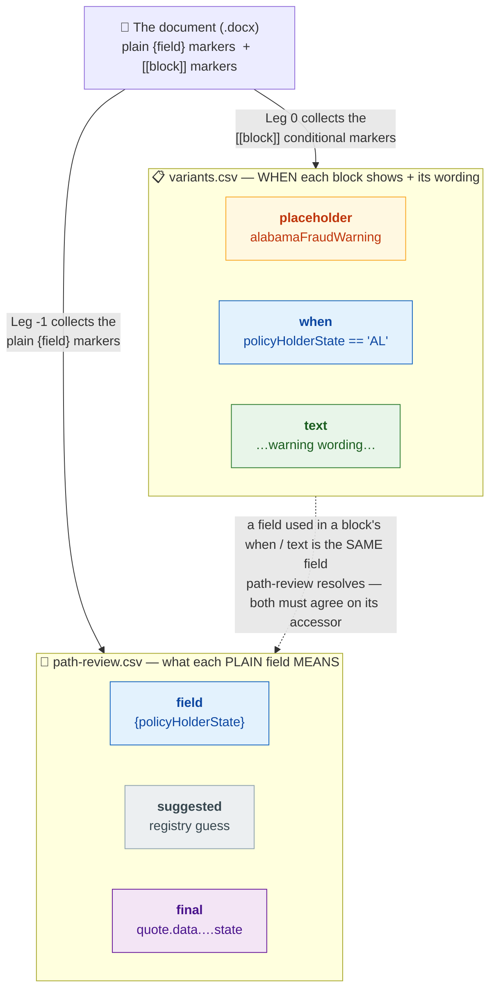

# The two customer-fill files: `path-review.csv` and `variants.csv`

**Audience:** anyone (human or model) looking at the two files in
`workspace/action-needed/` and asking "why are there *two*, and how do they relate?"

When the customer is handed their intake package, `action-needed/` contains exactly two
files to fill:

| File | Comes from | Answers the question |
|---|---|---|
| `<stem>.path-review.csv` | Leg -1 | "what does each **plain field** in the document mean?" |
| `<stem>.variants.csv` | Leg 0 | "**when** does each conditional block show, and what does it say?" |

They split the document's dynamic parts in two: **path-review = the always-there values**,
**variants = the bits that only sometimes appear**. Together they cover the whole document.

---

## What's in each

**`path-review.csv`** — one row per plain `{field}` the author wrote in the body
(`Dear {policyHolderName}, …`). Columns: **`field`** (the bare marker), **`suggested`**
(registry guess), **`final`** (the accessor to actually use — the human confirms or types it).

**`variants.csv`** — one row group per conditional block: either a named `[[$token]]`
block the author wrote in the body, or a `[Name/]…[/Name]` loop section. Columns:
**`placeholder`** (the block's name), **`when`** (the show/hide condition), **`text`**
(the wording that prints when the `when` is true). A `[[$token]]` block gets a
conditioned row + a default row (more rows for an N-way pick); a `[Name/]` loop gets a
single `when`-only row with no `text` — the section's wording stays in the document, and
a blank `when` just means the loop always shows.

---

## How they interact

Two ways:

1. **They divide the document.** Anything the author wrote as a plain `{field}` becomes a
   path-review row; anything wrapped as a `[[$token]]` block or a `[Name/]` loop becomes a
   variants row. Neither file
   alone is the whole picture — path-review without variants drops the conditional sections,
   variants without path-review leaves the body blanks unresolved.

2. **They share the same fields.** The *same* data field often shows up in **both** files —
   once as a printed value (path-review) and again inside a block's `when` or `text`
   (variants). When that happens, **they must mean the same accessor.** The classic case:
   `policyHolderState` is printed in the address block (a path-review field) *and* it decides
   which state-specific clause prints (a variants `when`). If path-review resolves it one way
   and a `when` references it another, the document is internally inconsistent.

---

## The edge case: a field that appears *only* inside a block

Sometimes a data field is written **only** inside a block's `text` and nowhere in the
plain body — e.g. `{coolingOffPeriod}` typed into a `variants.csv` `text` cell. It still
prints, so it still needs an accessor, so it still needs a `path-review.csv` row. But
Leg -1's first pass only scans the plain body — it never sees a leaf that lives inside a
block, and a plain Leg -1 re-run will **drop** the row for it.

To pull those variant-text leaves into `path-review.csv` (with a registry suggestion),
re-run Leg -1 pointed at the filled `variants.csv` — this is **pass 2**:

```
python3 -m velocity_converter.legminus1_resolve_paths \
  --input <doc> --registry registry/path-registry.yaml \
  --output-dir workspace/output \
  --variants-csv workspace/action-needed/<stem>.variants.csv
```

Pass 2 *appends* only the net-new (variant-text) leaves onto the existing CSV. **This is
where the suggester earns its keep early:** it maps a hand-added leaf to the config
accessor for you instead of leaving a blank to fill from scratch — so even a run that
started `suggestions=off` benefits from flipping predictive for these.

> ⚠️ **The suggested accessor is not the final render path.** Leg -1 (and the registry)
> emit the root-relative form — `coolingOffPeriod` shows as `policy.data.coolingOffPeriod`
> and the registry stores `$data.data.coolingOffPeriod`. A bare `$data.data.<field>` does
> **not** resolve in renderingData; the entity-key splice (→ `$data.segment.data.<field>`
> for a segment custom field) happens in Leg 2. The path-review value is a pre-splice
> pick, not the template path.

---

## A short story

> Sam hands Priya two sheets and says: *"Same letter, two jobs."*
>
> **Sheet 1 — `path-review.csv`.** "Every blank you left in the letter, I've listed here.
> Just confirm what each one means." Priya sees `{policyHolderName}`, `{policyNumber}`,
> `{policyHolderState}`… and ticks the accessor for each. This is the stuff that prints on
> *every* letter, no matter what.
>
> **Sheet 2 — `variants.csv`.** "Some paragraphs only show for some customers. For each one,
> tell me *when* it appears." Priya sees a row called `alabamaFraudWarning` and writes its
> `when`: `policyHolderState == "AL"`. The wording's already in the `text` column.
>
> Then she notices something: `policyHolderState` is on **both** sheets. On Sheet 1 it's the
> state printed in the address. On Sheet 2 it's the thing that decides which fraud warning
> shows. *Same field, two jobs* — exactly like Sam said. So the accessor she confirmed on
> Sheet 1 has to be the same field the Sheet 2 condition is testing. If they drift apart, the
> address could say "TX" while the Texas warning fails to print.
>
> The lesson: **path-review says what a field *is*; variants says what a field *does*. A field
> can do both, and the two sheets have to agree about it.**

---

## The diagram



The **blue** stripe is the same data field (`policyHolderState`) appearing in *both* files —
as a `field` row in path-review and inside a `when` in variants. That shared field is the
interaction: path-review pins its accessor, and every variants `when`/`text` that uses it must
mean that same accessor.

---

## Rules of thumb

- **Fill both** — they're two halves of one document.
- **A field on both sheets must resolve to one accessor.** path-review is where its identity
  is confirmed; variants must reference it consistently.
- **Plain value → path-review. Conditional section → variants.** If you're unsure which file a
  field belongs in, ask: "does this *always* print, or only *sometimes*?"
